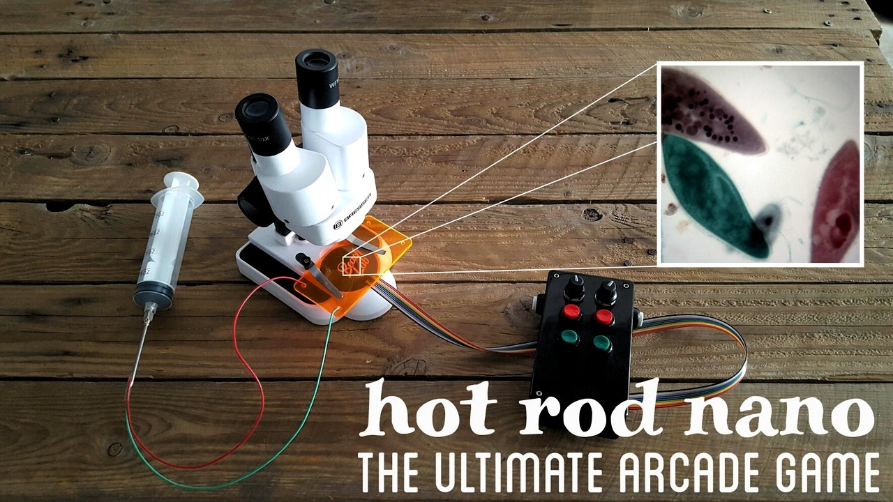
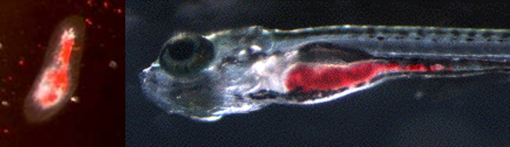
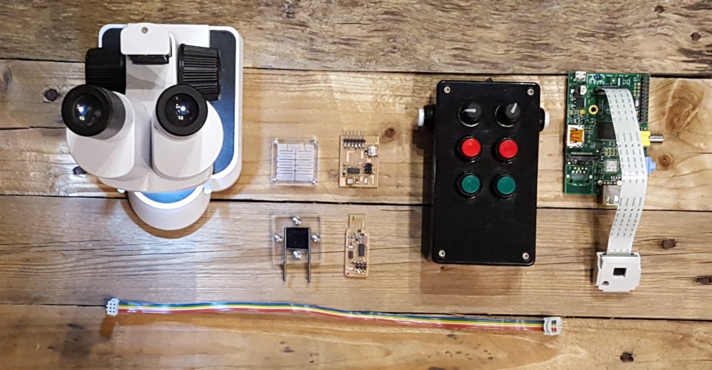
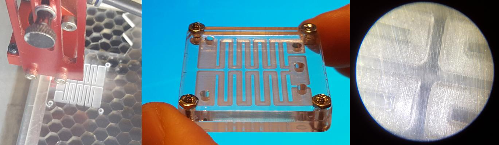
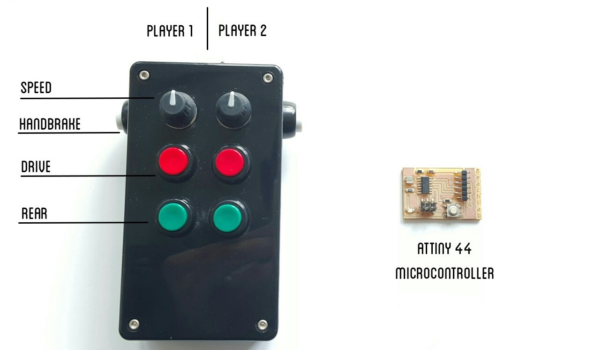

# Hot Rod Nano

## Abstract
Hot Rod Nano is a **2 players arcade game featuring nature _vs_ genetically modified Paramecium**. With a locomotion efficiency of less than 1%, the Paramecium has a lot of potential for improvement. The skills used in the project are microfluidics, open hardware, next generation synthesis and synthetic development biology.

## Dragsters
The specie used for the project is _Paramecium Caudatum_, one of the biggest ones, oval shaped and measuring around 300 micrometers (0.3 mm) so that they are visible with a normal microscope. Paramecium can travel at 1000 µm/s [(Bray, Dennis. Cell Movements. New York: Garland, 1992.)](http://hypertextbook.com/facts/2000/RossKrupnik.shtml), so a typical race (50 mm) should take around a minute.

### Genetic modification
Since I am not biologist nor genetist this part of the final project is **still under research phase**. Also, **I am not confident about being able to perform this modification** with the time/funds/equipment limitations.

If the **Protozoa Rights Association** does not sue me, the Paramecium will be genetically modified using Next Generation Synthesis techniques. Initially the goal of this modification was staining the cells so that I could distinguish the teams. But after a short talk with Nuria and Marc (our biologist and genetist) I later abandoned the idea because they said that even if I succeed it was going to be difficult to see the color. So now the goal of this modificiation is achieving faster speeds with faster movements, or longer cilia.

The modified DNA will be introduced in the Paramecium using shotgun. The species that adopted the modification will also have an specific antibiotic resistance, so the ones who survive to that antibiotic environment will be the ones who incorporate the gene.

### Stain
For improved visualization and players diferenciation **the Paramecium will be stained using food**. According to [the supplier](http://www.parameciavap.com/paintedpar.html), the stain is not harmful for the Paramecium and will last for three days.

## Race tracks iteration 2
At the beginning, the race track were supposed to be two **rectilinear and parallel [microfluidics](./w12.html) channels and chambers** with luers at the beginning and at the end. This is how the characterization at the beginning of the page was supposed to be. But then I changed my mind (kind of usual) and decided to do a small square [paramecium device which I built for week 9](./w09.html) (and what by the way it didn't work and now the project requires iteration 3)

Later these race tracks were supposed to have **different shapes** and therefore be interchanged between the luers. In the future the game could evolve into a _Grand Prix Nano_.

### Culture Chip microfluidic design
These have been **parametrically designed** in [Antimony](https://github.com/mkeeter/antimony), a software by Matt Keeter. The main design parameter is **based on the size of the Paramecium**.

**The goal of this device is to grow separately the 2 species of genetically modified Paramecium with the same LB**.

I did not use any glue for the culture chip because the chemicals used in those products are toxic and could alter the grothw and speed of the racers.

## Gamepad
The players have game pads that **electrically stimulate the movement** of Paramecium.

Inside the race tracks there are insets for  2 mm HB graphite bars from mechanical pencils, which connected to an attiny microcontroller. The buttons on the gamepad activate the microcontroller pins which electrically stimulate the Paramecium cilia.

### Electronics
The gamepad control board has been designed using a legacy version of [kokopelli](http://kokompe.cba.mit.edu/downloads.html), also from Matt Keeter.

### Code
The **main challenge** of the code, as we realized when we were doing the paramecium assignment **is finding the correct PWM pulse** that creates the appropiate behaviour in the paramecium.

Paramecium swim slower when a voltage is applied. **The more the voltage the more slow but the most rectilinear towards the negative electrode**. So this combination of random and fast and precise but slow is a good feature that keeps the game so enjoyable.

## Open hardware tracking broadcast camera
The race is broadcasted live through an follow me microscope, which consist in a Raspberry Pi equipped with a camera that follows a certain object using [OpenCV](http://opencv.org/). This will also

## What worked and what didn't
The paramecium devide did not work as expected because it was leaking everywhere. This was caused because I did not want to seal the seams with chemical products.

The gamepad and paramecium as shown is [week 9 video](./w09.html) works very well and it is very fun to play. But sometimes I feel bad about the poor Paramecium. I wonder if they feel pain when we play with them.

I could not acquire the required knowledge to genetically modify the Paramecium. Actually Marc and Nuria, our biologists in this challenge told me that this is far more complex than genetically modify a bacteria like e-coli or yeast because of the complexity of the organism.  
