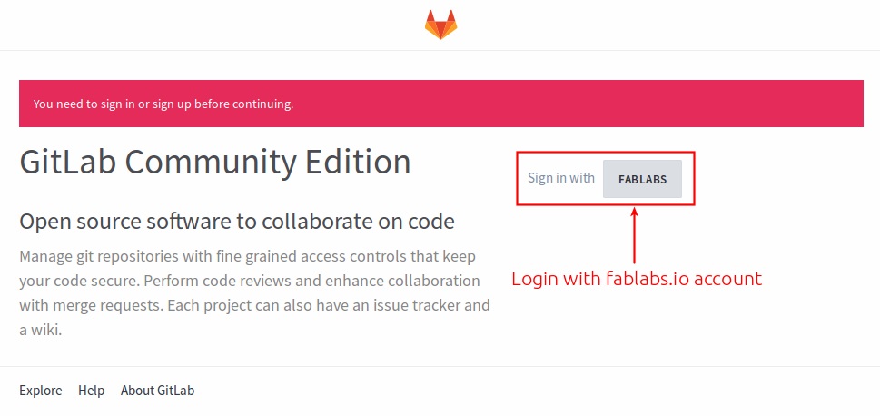
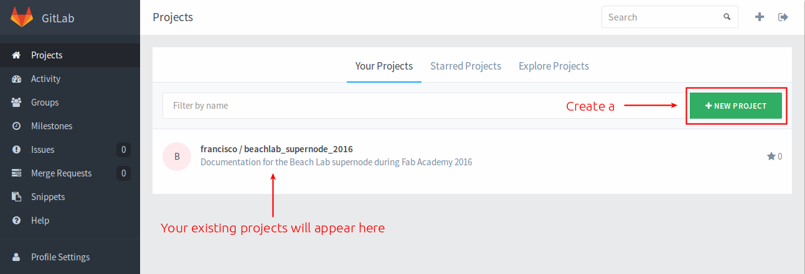
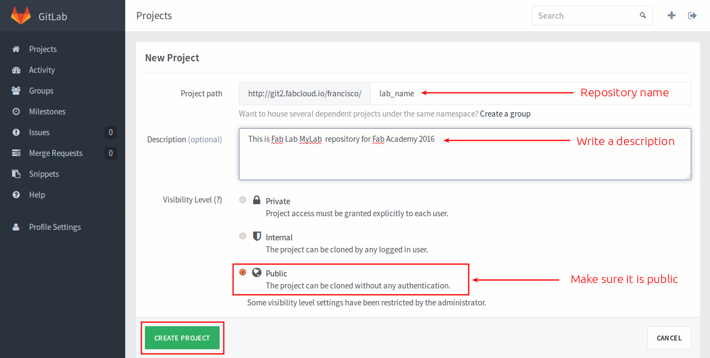
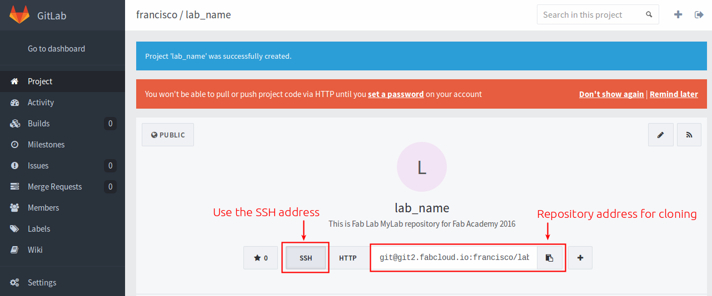
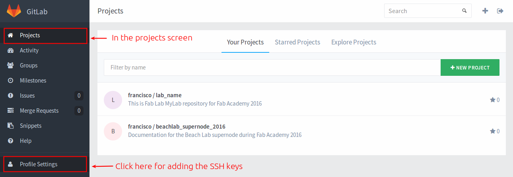
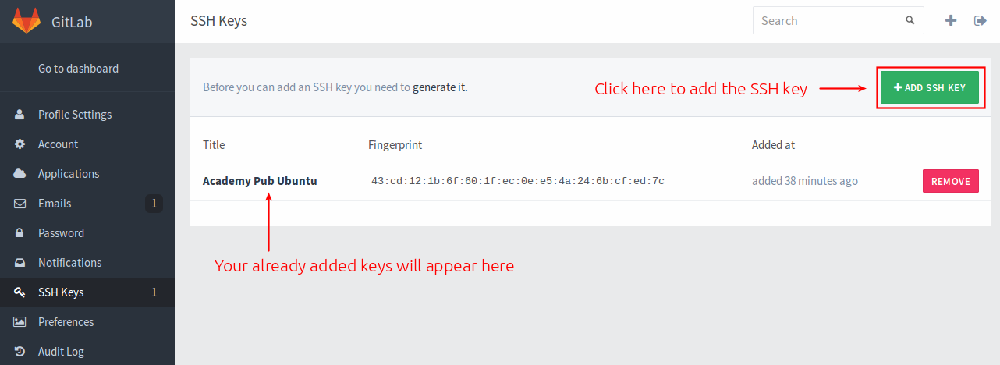
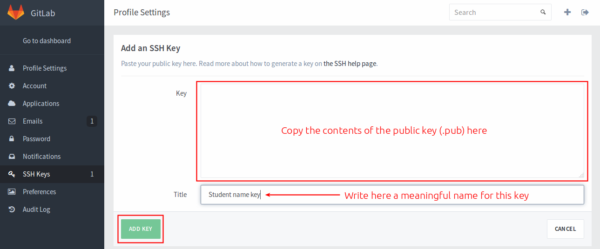

# Working with repositories
In HTGAA, like in Fab Academy (HTMAA) **we are working with git repositories**. In the past we used a single **mercurial** repository. I'll not get into the details but it was _somewhat_ annoying. Now every lab has a git repository where students push and pull their work. The advantages of working with repositories are countless, you can create branches, roll back changes, delete other people's files and many other things that you will hate very soon.

# For lab managers only

## Init a repository
**Warning this instructions are for HTGAA 2015. Maybe in 2016 the instructions are different**. This is a one time setup that has to be done for setting up a lab repository by the lab manager.

### Step 1. Login to FabCloud
Go to <http://git.fabcloud.io> and login using your <http://fablabs.io> credentials  (if you don't have a fablabs.io credential, you will have to create one first).


### Step 2. Create the repository
Create a new project, just press the **+ NEW PROJECT** button:



Fill in the repository name (**I strongly recommend that you use _htgaa_ for the repository name**), a description, mark it as public and press the **CREATE** button:



### Step 3. Get the cloning address
Once the repository is created you will see an address, **this is the address that you have to give to your students for cloning the repository in their computers**.



### Step 4. Add the SSH key
We are now going to add the **HTGAA SSH key** to this project. The keys will be created and shared to you by the lab manager. Go back to the projects page and click on profile settings.



And click on **+ ADD SSH KEY**



One option could be asking every student to [generate it's own SSH keys](https://help.github.com/articles/generating-ssh-keys/). But it is going to be easier to do the opposite: A SSH key has been already generated. You have to add the contents of the **public** key (copy all with a text editor) to the repository. Every student will have to add the keys to their systems (explained below).



## Where is the website?
**The HTGAA team will do this for you. You can skip this section unless you want to learn how to create another webpage from a repository**. There is no website, because gitlab is not a webserver. You need to deploy this site to a web server.

For my personal repositories I use [git-ftp](https://github.com/git-ftp/git-ftp) which is a command line tool that pushes the site to a ftp folder.

### Installing git-ftp
```
sudo add-apt-repository ppa:resmo/git-ftp
sudo apt-get update
sudo apt-get install git-ftp
```

### Prepare your ftp folder
Create a folder in your web server, say it is `fab2016`

### Do initial push
You only have to do this step the first time
```
cd ~/fab2016
git ftp init -u <user> -P ftp://host.example.com/fab2016
```

### Normal workflow
Every time you run this command, the repository will be uploaded to the webserver via FTP.
```
cd ~/fab2016
git ftp push -u <user> -P ftp://host.example.com/fab2016
```

# For Students

## Installing git
To install **git** in Ubuntu type in a terminal window:

`sudo apt-get install git`

## Clone the repository
Your lab manager will provide you with a SSH address to clone the repository. In your computer navigate to where you want to clone the repository:

```
cd ~
git clone REPLACE_THIS_WITH_GIT_SSH_ADDRESS
```

## Configuring git
Set some basic config and tell git who you are. Maybe I don't have to say that but replace **yourname** with your actual name and **youremail** with your email address.
```
cd ~/htgaa # Asuming this is the repository name
git config --global user.name "yourname"
git config --global user.email "youremail"
git config --global push.default simple
```

## Add SSH keys to your system
Your lab manager will provide you with a pair of SSH keys. Say they are named `htgaa` and `htgaa.pub`. Move these keys to your `~/.ssh` folder and set permissions on the private key:
```
mv htgaa ~/.ssh
mv htgaa.pub ~/.ssh
chmod 600 ~/.ssh/htgaa
```
And now add the keys to the system:
```
eval "$(ssh-agent -s)" # Ensure ssh-agent is enabled
ssh-add ~/.ssh/htgaa   # Add your SSH key to the ssh-agent
```

## Basic git workflow
This is the basic git workflow. Once you have made all changes to your website (hopefully daily), upload those changes to the repository. **Very important:** Do not miss any step, and do them in order.
```
cd ~/htgaa                # go to the repository folder
git pull                  # pull other students changes
git add --all             # add your changes
git commit -m "message"   # write a meaningful message
git push
```
This is the manual workflow of updating your page. You can also write a script and  [automate this process](./doc.html).

## Rolling back changes

## Troubleshooting

### SSH connection not working
Sometimes git asks for my repository password even if I have specified to use SSH keys. So what I do is check if the keys are in the **ssh-agent**:
```
$ ssh-add -l
Could not open a connection to your authentication agent.
```
In this case the **ssh-agent** was not running, so I start it using:
```
$ eval `ssh-agent -s`
Agent pid 3032
```
I check again and now the problem is that the agent has no identities:
```
$ ssh-add -l
The agent has no identities.
```
I list the keys in my `.ssh` folder:
```
$ ls ~/.ssh
htgaa  htgaa.pub  config  known_hosts
```
I add the `htgaa` key, which is the key added in git
```
$ ssh-add ~/.ssh/htgaa
Identity added: /home/irix/.ssh/htgaa (/home/irix/.ssh/htgaa)
```
I check again:
```
$ ssh-add -l
2048 SHA256:D0Yg6HyzIzD9mIIpytearRhVc2YMYEtIpqP664EjEzU /home/irix/.ssh/htgaa (RSA)
```
An then, git pull and push using SSH works again. I still don't know why this happens, I suspect this is something related when I put the computer to sleep and it awakes in another wifi network. If I restart the computer these steps are not required.
