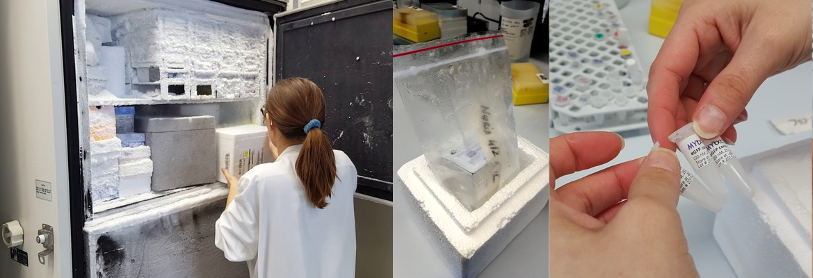
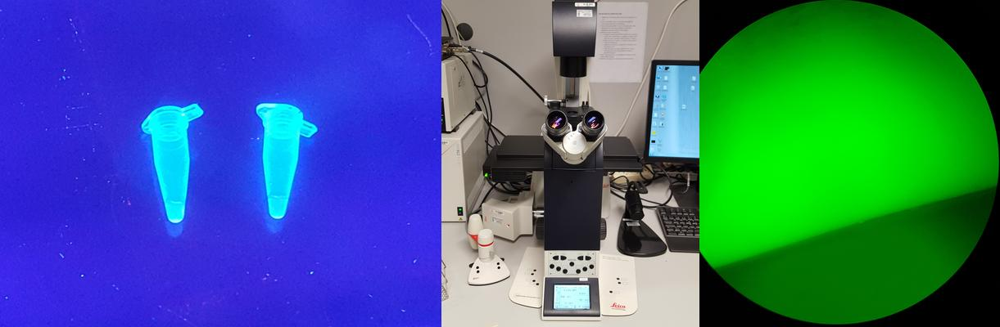

# Week 3. Synthetic Minimal Cells

## Lecture video
Link to the [video lecture](https://vimeo.com/138767343)

## Lab assignment: Express GFP in cell free system
For the lab assignment we went for the **Cell free Tx/Tl system developed by Vincent Noireaux**. Their lab was so kind to sponsor the Tx/Tl system and we only had to pay for the shipping. Shipping though, was quite expensive (around 400 EUR per lab, but we shared the expenses among many labs). Actually the package that was shipped to every lab could be used to perform several experiments, so for next year maybe it's a good idea to share it across labs in a region. I was quite surprised when Nuria opened the -80ºC freezer and I saw that _the thing_ they sent to us was less than a water drop. I was expecting something bigger, like one bottle of product.

**Documentation tip:** to concatenate 2 or more images like the one above you can use the package graphicsmagick `gm convert image1.png image2.jpg image3.jpg -geometry x400 +append resulting_image.jpg`.

The **protocol** is quite simple. The protocol is the instructions on how to do the experiment, you will see quite a lot of these during HTGAA. Some of them are very long:

> 1. Thaw the enzyme mix on ice (or in the fridge) immediately before use.
> 2. For 10uL reaction: use 7.5uL of enzyme mix, x*uL DNA vector to the final concentration 5nM, add water to the final reaction volume.
*We will know what's the stock c of DNA vector soon
> 3. Mix by gently pipetting up and down several times. Do not vortex.
> 4. Incubate at 29-30C for minimum of 2 hours, ideally longer - 4h.
> 5. Analyze GFP fluorescence immediately. The fluorescence of GFP can be analyzed in the reaction mix, without purification. Use Nanodrop, or small volume cuvette fluorimeter. Scale appropriately if needed.  

Then we tried to detect the GFP positive control under a UV lamp in the PRBB Lab but we could not tell any difference at all. Then we used the fluorescence microscope and could see how the positive control was glowing and the negative control wasn't glowing. I didn't understand why, but it was amazing!

## Design Assignment: Design synthetic cell biosensor, reactor or actuator

### Pick a function
Since we are at [The Beach Lab](http://beachlab.org), and the sea is just opposite the lab, **I chose a biosensor for detecting heavy metal ions in sea water**.

### What would your synthetic cell do? What is the input and what is the output
The input is the heavy metal ion we want to detect and the output is a metal binding protein that will trap metal ions.

### Could this function be realized by cell free Tx/Tl alone, without encapsulation?
No, I don't think so.

### Could this function be realized by genetically modified natural cell?
Yes, in theory it could be possible.

### Describe the desired outcome of your synthetic cell operation
A marker that reacts ans show us when the synthetic minimal cell is expressing the binding protein due to the presence of the heavy metal.

### Design all components that would need to be part of your synthetic cell. What would be the membrane made of?
A [Phospholipid](https://en.wikipedia.org/wiki/Phospholipid) membrane.

### What would you encapsulate inside?
ATP for energy transformation, DNA, mRNA.

### Which organism your tx/tl system will come from? is bacterial OK, or do you need mammalian system for some reason?
> **Hint:** For example, if you want to use small molecule modulated promotors, like Tet-ON, you need mammalian)

Bacterial is OK.

### How will your synthetic cell communicate with the environment?
> **Hints:** Are substrates permeable? or do you need to express membrane channel?

With Green Fluorescent Protein ([GFP](https://en.wikipedia.org/wiki/Green_fluorescent_protein)).

### Experimental details. How will you measure the function of your system?
With a fluorescence microscope.

## What I learned
This lab experiment is easier than it looks. A normal fab lab can execute this experiment, **there is no need for a -80ºC freezer** if you proceed immediately when the package arrives. The pipetting step only takes around 20 minutes to complete.

## Assignment review
On Wednesdays we always have a review session of last week's assignment. Here is the link to this week [assignments review](https://vimeo.com/139480382).

---

## [<<](./w02.html)  [  home  ](./index.html)  [  >>](./w04.html)
