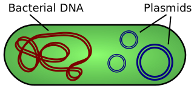
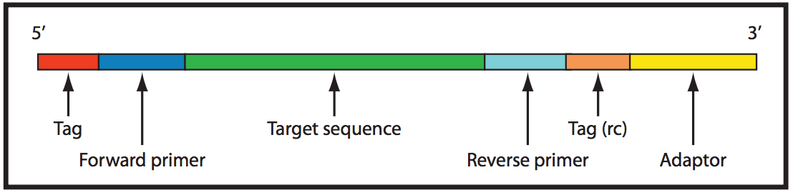
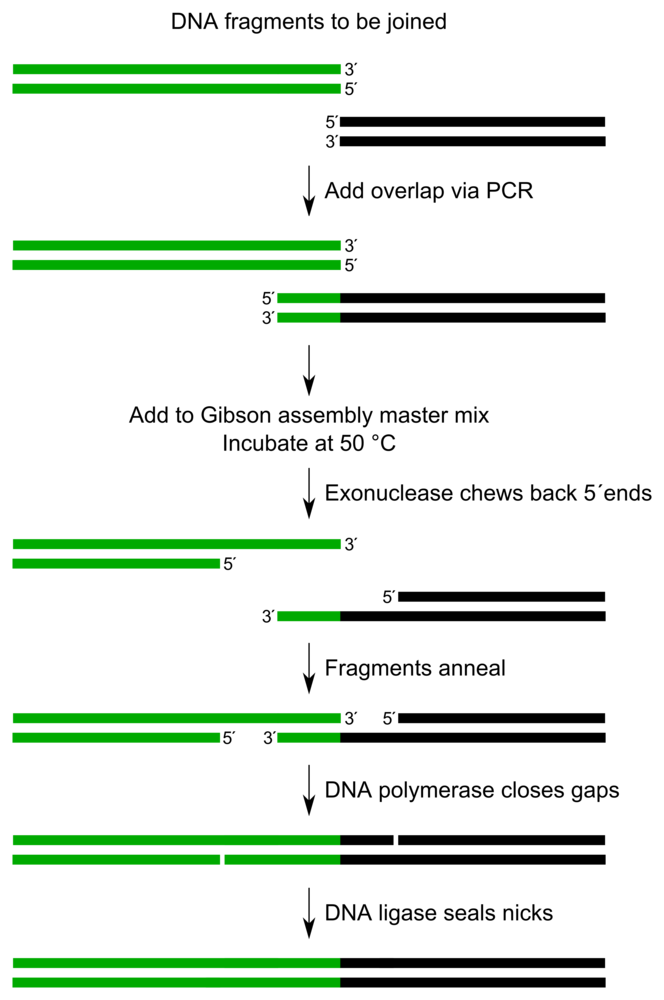
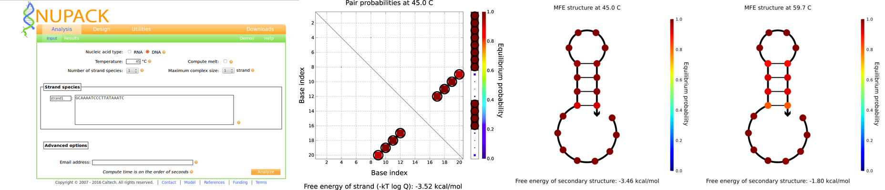
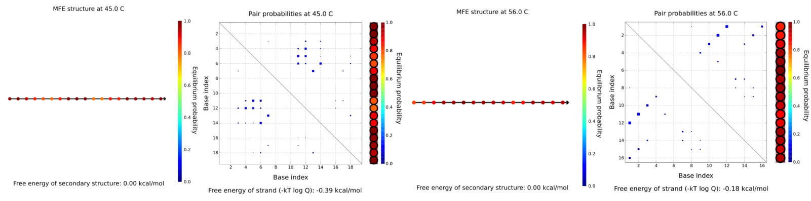
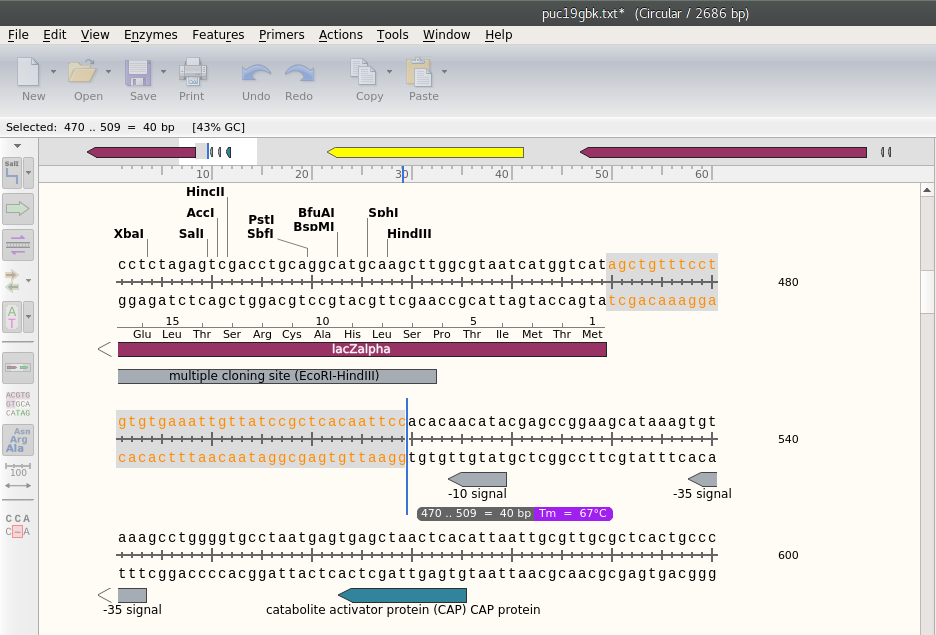
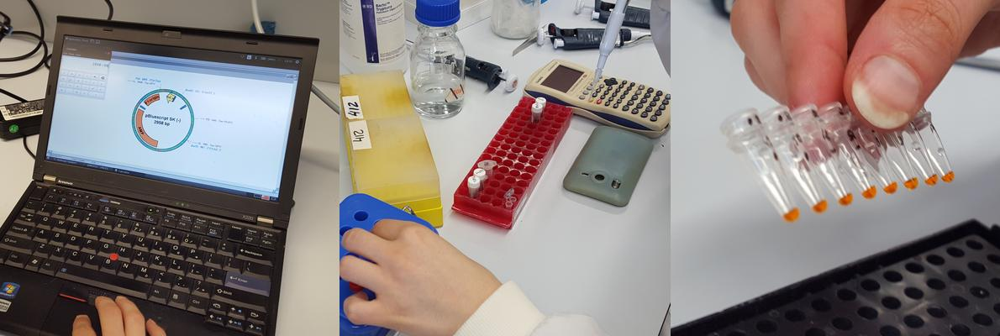
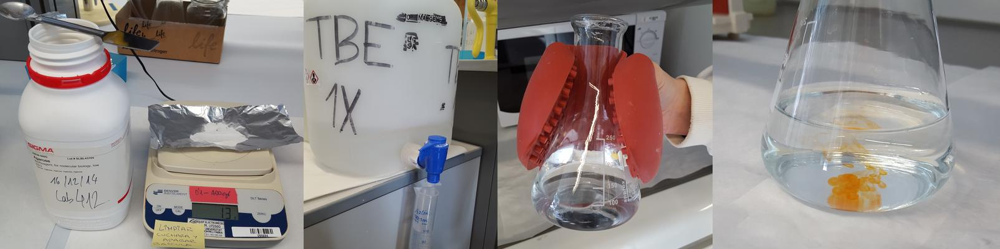
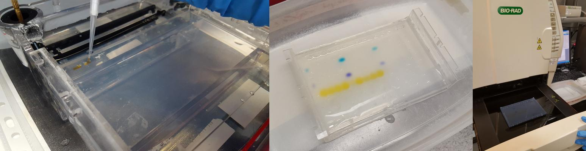
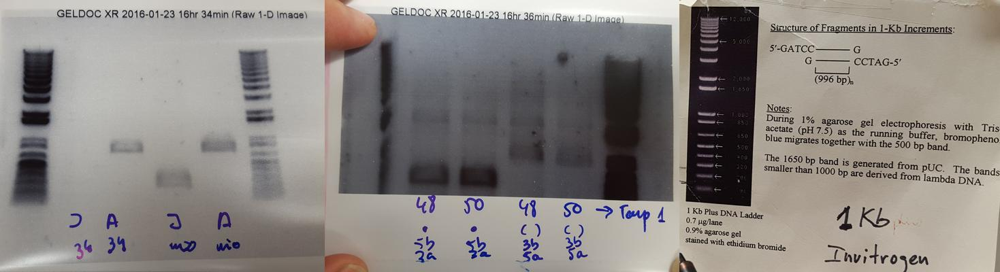

# Week 4. Next generation synthesis

## Lecture video
Link to the [video lecture in HTGAA'15](https://vimeo.com/139481662)

## Assignment 1.  Primer design to linearize plasmid backbone

### The long story short

A plasmid is a small **circular**, double-stranded DNA molecule within a cell that is physically separated from a chromosomal DNA and can replicate independently (source [Wikipedia](https://en.wikipedia.org/wiki/Plasmid)).

What we need to do in this assignment is **design primers**, these are short oligonucleotides that we will insert in the plasmid. During the class, Joe Jacobson explained some assembly methods. None of them work with circular DNA molecules, so first we need to linearize it. We will do it with a technique called PCR (Polymerase Chain Reaction).

 When the plasmid is heated at high temperature, the DNA splits in its 2 complementary circular parts. Then the solution is cooled at a work temperature where the oligos (primers) that we designed are going to be tied (annealing) to each of the halves creating incomplete plasmids. Then we cool it back down to a temperature where the polymerase will extend from that primer and complete the plasmid. The process is repeated again and again and each cycle you get twice the number of molecules.

 The thing is that you want to design primers that are not going to hybridize to itself or have any structure within itself. And the way to visualize it is with a piece of software called Nupack.

### Software setup
**Nupack (nucleic acid package)** is a software suite for the analysis and design of nucleic acid systems. You can either [download the source code](http://www.nupack.org/downloads/register) and compile it or use the [web version](http://www.nupack.org/partition/new) instead (like I did).

> The selection of the primer can also be done with **Primer3**, a widely used program for designing PCR primers. In fact, Primer3 will search for the best 20 bp of a long DNA sequence taking into account many other parameters. But if you do that, you won't see what is happening under the hood and hence you won't develop an intuition of why is one structure better than another or what is doing Primer3 when you run it. And that's one of the goals of this week. Take into account that **the fundamentals of primer design are critical for sythetic biology and genome engineering**. Later on you will be learning about CRISPR. And what makes it such a powerful technology is the ability to properly design what is called the guide RNAs which are basically this type of primers that specify the exact location on a genome to make an edit. So developing this intuition is foundational to this whole course.

### Theory
_Use NuPack to help select 18 bp priming sites that amplify a ~2.25 kb region of [pUC19 (NEB)](./files/w04/puc19gbk.txt) immediately upstream of the **plac promoter** and downstream of the start of **lacZalpha**. The resulting **amplicon** excludes the plac promoter and n-terminus of lacZalpha, which enables you to swap in a gene of interest under the control of a promoter of interest using **Gibson Assembly** later on in your workflow. Design one pair of **oligos** that prime optimally and another that prime poorly. Describe the PCR thermocycling program that uses [Phusion polymerase (NEB)](https://www.neb.com/products/m0530-phusion-high-fidelity-dna-polymerase) for these pairs. Crucially, determine annealing temperatures and extension times._

I don't even understand the question. I started by looking up for the definition of some of those cryptic words:

> **plac:** No idea, I can't find a related definition. Tomorrow I'll ask our biologist.
>  
> **Promoter** (from [Wikipedia entry)](https://en.wikipedia.org/wiki/Promoter_%28genetics%29): In genetics, a promoter is a region of DNA that initiates transcription of a particular gene. Promoters are located near the transcription start sites of genes, on the same strand and upstream on the DNA (towards the 5' region of the sense strand -_the one that runs from 5' to 3'_-). Promoters can be about 100–1000 base pairs long.  
>
> **Amplicon** (from [Wikipedia entry)](https://en.wikipedia.org/wiki/Amplicon): An amplicon is a piece of DNA or RNA that is the source and/or product of natural or artificial amplification or replication events. It can be formed using various methods including polymerase chain reactions (PCR), ligase chain reactions (LCR), or natural gene duplication. In this context, "amplification" refers to the production of one or more copies of a genetic fragment or target sequence, specifically the amplicon.
>
> 
>
> The [picture](https://en.wikipedia.org/wiki/Amplicon#/media/File:Amplicon.png) above is an amplicon sequencing template, where the amplicon is shown in green. From [original article](http://www.ncbi.nlm.nih.gov/pmc/articles/PMC3120705/): "Amplicon sequence structure. Illustration of raw amplicon sequences with tags, primers and adaptors colored in red, blue and yellow respectively. The target sequence amplified by PCR is shown in green color."
>
> **Gibson Assembly** (from [Wikipedia entry)](https://en.wikipedia.org/wiki/Gibson_assembly): Gibson assembly is a DNA assembly method which allows for the joining of multiple DNA fragments in a single, isothermal reaction (...) The method can simultaneously combine numerous (>10) DNA fragments based on sequence identity. It requires that the DNA fragments contain ~20-40 base pair overlap with adjacent DNA fragments. These DNA fragments are mixed with a cocktail of three enzymes ([exonuclease](https://en.wikipedia.org/wiki/Exonuclease), [DNA polymerase](https://en.wikipedia.org/wiki/DNA_polymerase), and [DNA ligase](https://en.wikipedia.org/wiki/DNA_ligase)), along with other buffer components.
>
> The exonuclease chews back DNA from the 5' end. The resulting single-stranded regions on adjacent DNA fragments can anneal. The DNA polymerase incorporates nucleotides to fill in any gaps. The DNA ligase covalently joins the DNA of adjacent segments, thereby removing any nicks in the DNA.
>
> The entire mixture is incubated at 50 °C for up to one hour. The resulting product is different DNA fragments joined into one.
>
> 
> [Image](https://en.wikipedia.org/wiki/Gibson_assembly#/media/File:Gibson_assembly_overview.png) by Tobias Vornholt
>
> **Oligo (abrv. of Oligonucleotide)** (from [Wikipedia entry](https://en.wikipedia.org/wiki/Oligonucleotide)): Oligonucleotides are short DNA or RNA molecules, oligomers, that have a wide range of applications in genetic testing, research, and forensics (...) these small bits of nucleic acids can be manufactured as single-stranded molecules with any user-specified sequence, and so are vital for artificial gene synthesis, polymerase chain reaction (PCR), DNA sequencing, library construction and as molecular probes (...) Oligonucleotides are characterized by the sequence of nucleotide residues that make up the entire molecule. The length of the oligonucleotide is usually denoted by "-mer" (from Greek meros, "part"). For example, an oligonucleotide of six nucleotides (nt) is a hexamer, while one of 25 nt would usually be called a "25-mer"

I learned from the Swiss team the rules for selecting good primers. In short they should be around 20-30 nucleotides in length, with a GC content between 40-60%, a melting temperature of 55-65º, without runs of over 3 nucleotides (like CCCC or GGGG) and a few more rules.

We did not use the pUC19 plasmid, But the pBluescript SK (-) 2958 bp because this plasmid was here at the prbb and we did not have to order new plasmids for the PCR. Nuria uses a program called pDRAW to visualize and analyse the plasmids. and she is able select the primer by eyeballing. Amazing. She selected these three primers:

>    5b: CGGTGTAGGTCGTTCG Tm=56ºC  
     3a: GCAAAATCCCTTATAAATC Tm=45ºC  
     prbb: GGGATTTTGCCGATTTCGGC Tm=59ºC

 We analyzed these primer sequences using the web version of NUPACK. We use the option **Analyze**. As can be seen in the pictures below only the primer named prbb exhibit secondary structure. This oligo has high probability to perform a loop. Eight of the bases align: the 9th base with the 20th, the 10th with the 19th, the 11th with the 18th and the 12th with the 17th, as it is shown at in the graphic of the pair probabilities. We calculated the secondary structure at the proper annealing temperature of the primer (59.7 C ) and at the lowest temperature of the other primers (45C).  

 

The same analysis was performed for the oligos that we labeled as 5b and 3a (where 5 and 3 indicate the direction; forward or reverse). For both sequences, the suggested annealing temperature was suggested by pDRAW. As you can see no secondary structure is predicted. Despite its low annealing temperature, we decided to order the 3a instead of prbb sequence.

### HTGAA'16 Revisit
This time I will use the pUC19 plasmid. I am using [SnapGene Viewer](http://www.snapgene.com/products/snapgene_viewer/) to view the plasmid. It is a 2686 bp plasmid. Note that bp numbers grow clockwise, with the origin mark at the top of the circle. But the arrows grow counter-clockwise. All together the convention is quite confusing.

The area to be selected is immediately upstream of the plac promoter and downstream of the start of lacZalpha, and that corresponds to 40 bp highligted below.

From this area we have to select our 18 bp and test them in Nupack:  
`Upstream 5'-agctgtttcctgtgtgaaattgttatccgctcacaattcc-3' Downstream`

### Experiment
In the PRBB (Barcelona Biomedical Research Laboratory where Nuria works) they use three different polymerases: the Phu native, the Flexi Gotaq and the Phusion HF. Unfortunately all of them exhibit 3'-5' exonuclease activity. She couldn't find the Vent(exo-) or other any -exo polymerase in any of their neighbor labs. Since polymerase is an expensive reactive, Nuria decided to perform the PCR with Phusion HP only.

We received our desalted oligos at different concentrations (the number of nmoles x 10 will give you the amount of solvent to add in microliters for a 100 µM stock solution):

* 5b 34.3 nM we added 686 ul of water to have it a final concentration of 50 µM
* 3a 28.8 nM we added 576 ul of water to have it at final concentration of 50 µM

For a final volume of 50 µl we used:

* 1 µl of our plasmid (around 800ng/ul)
* 1.25 µl of each primer
* 1 ul of dNTP already mixed at 100 mM
* 10 ul of Buffer 5x
* 0.7 ul of Phusion HF polymerases
* 34.5 ul of pure water (DNAase free).

We prepared 4 different tubes. Two with the correct oligos orientation and two with the same oligos but _wrong_ orientation. And we run both types of mixes at different annealing temperatures at PCR.

We prepared a 0.8% agarose gel:
1.2 gr of agarose in 150 ml of TBE 1x buffer and 5 ul of sybersafe (added at the agarose after cool down). We let running the gel at the electrophoresis cube for 20 min at 110 V.

The thing is that **something went wrong**. The experiment failed. We obtained things that we were not supposed to obtain. Nuria and Adolfo decided to repeat the experiment and at this second attempt the gel broke during transportation to the UV lamp.

**I decided not to repeat the experiment, but to analyze why the experiment failed**. In hardware we call it debugging. Nuria told me that maybe I could not find a reason. That biology does not work as engineering. In biology maybe you run two experiments, exactly following the same procedures and one could just fail. It is a matter of probabilities. But I will try my best:

* We did not use the Vent(exo-) polymerase.
* The scale had a problem, the value on the display grew over time. But I don't think that ruined the experiment.
* We accelerated some processes. We put the agarose gel in a fridge to solidify sooner. We also put the agarose in a microwave for longer time than recommended in order to make it dissolve.
* When we were pipetting into the gel some of the liquid sometimes was _flying_ and could potentially end-up inside another wells. But Nuria told me that this could not be the reason of the failure according to the results.
* It could be a PCR problem, maybe the designed temperatures were not the correct ones.
* It could be a mistake when we selected the eppendorf samples from the fridge. The labeling wasn't very good.
* It could be a pipetting mistake.
* Or it could just be a matter be probabilities as Nuria said.

The problem is that we will never know. **This is why I love hardware. When it fails it always fails. And when it works it always works. Well, to be honest, that is not true at all**.

## Assignment 2. Build a gene from shorter gene synthesis fragments
In HTGAA'15 I didn't move forward in the rest of the assignment since we could not complete the Gibson assembly (we did not obtain the three parts that we were supposed to obtain). In HTGAA'16 I am pursuing the theory part of this assignment.

### Theory
_Recode a fluorescent reporter and use NuPack to help design 200-300 bp IDT gBlocks for building the reporter with Gibson Assembly. Check that your 15-30 bp overlaps do not fold into undesirable secondary structure during the isothermal reaction._

## Assignment review
On Wednesdays we always have a review session of last week's assignment. Here is the link to this week [assignments review](https://vimeo.com/140202290).

---

## [<<](./w03.html)  [  home  ](./index.html)  [  >>](./w05.html)
