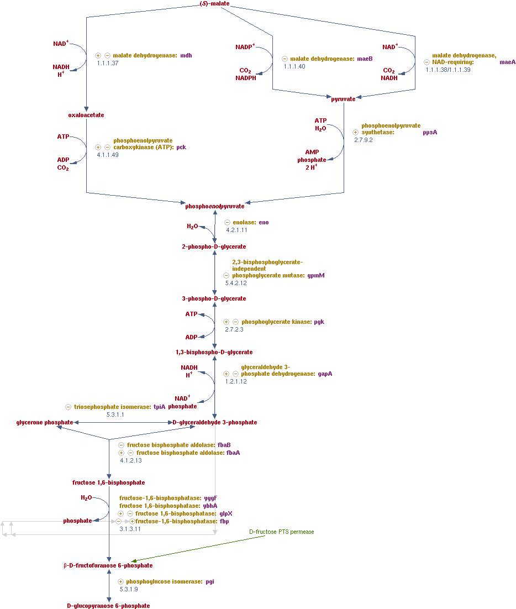

# Week 5. Bio Production

## Lecture video
Link to the [video lecture](https://vimeo.com/140203045)

## Last week Assigment Review
This week I am following the class from the Green Fab Lab, a fab lab located in the mountains of Barcelona. I arrived late and the review had already started. They have a really good bandwith because they are connected to a service called guifi.net with a directional antenna with someone from Ripollet. Crazy. Last week was about Next Generation Synthesis. Almost no one really did the assignments. Assignment number one only the Swiss as I can see. They look really proficient, they have quite a equipped bio lab and they know what their are doing. Not like us. Assignment number two, no one did it.

The second assignment was about designing DNA, then splitting it in small chunks that you can buy but you have to design these chunks so that you can you overlap at least 20 base pairs. But 80 base pairs are recommended. The goal is ordering (buying) these DNA segments.

>**NOTICE:** This is getting really hard to follow now

## Goal
The goal this week is to engineer metabolism.

Patrick Boyle is giving us the lecture today. He's from Ginko Bioworks, a company which engineers microbes like those used for making beer and typical commercial applications of this is tnew o produce different outputs like flavours or fragances.

There are three main steps. Design, build and test. The price per Base pair of Synthetic DNA is decreasing faster than Moore Law, lower than 0.1 USD per basepair currently. Machines is difficult to replicate for community lab because of the cost. Designing Biology is hard and success means failing a lot. An interesting question that someone made. What is the time scale from customer demand to have something to produce? It obviously depends but current time scale is around 6 months.

Part I. Connecting the dots. Two important concepts here are **Chassis** and **Pathway**. Chassis is the microorganism to be engineered. The selection depends upon some factors. Some typical chassis are Escheria and Saccha. A pathway is the biosynthetic route from a feedstock (like sugar) to the end product. There are 3 ways to design this. Combinations of existing pathways (the easiest) to engineering of existing pathways (harder) to de novo pathway design(the hardest). We will be focusing in the first one for the assignment. In practice there are resources like biocyc and kegg that combine literature and bioinformatics to map all known metabolism. How do we make pathway design and engineering process? Biology evolved once and all plants share most of the metabolism. Many properties emerge from combinatorial chemistry.

Part II. Getting parts. Evolution made our parts bin. So Enzymes and similar and we can move a enzyme from one specie to another. But why mix and match enzymes from different species? Some things may not work as expected. Evolution can be leveraged to source most bilogical parts. Sources like Uniprot.org they have curated enzyme information of you can search via sequence homology e.g. PSI_BLAST.

Part III. Optimization and tuning. There is a lot of work to do after you find the correct enzyme. Biology gives hints on how things are going to work. COBRA is an open source software. A couple of final thoughts. One is you can reprogram chassis pathways to serve your goals like producing more of a given product. And second is directed evolution. Mutations isn't easy to control but you get what you screen (selecting those that have more of a property you want) for.

## Assignment

### Design a biosynthetic strategy for a compound of your choice.

> Example: lycopene. Start from the end and work backwards. Or in biocyc there is a goal compound and hit search. Suggested molecules for the assignment: limonene, beta-carotene and violacein.

Chassis: Escherichia coli

Using: _Keseler et al. (2013), "EcoCyc: fusing model organism databases with systems biology", Nucleic Acids Research 41: D605-12._

Researching and choosing a pathway:  <http://ecocyc.org/pwy-search.shtml>

According to EcoCyc, Pathway: glycolysis II (from fructose 6-phosphate)

According to KEGG, Pathway: _ko00010 Glycolysis / Gluconeogenesis_

#### General Background
Glycolysis, which was first studied as a pathway for the utilization of glucose, is one of the components of central metabolism, the other two being the pentose phosphate pathway and the TCA cycle. As such, its functioning is essential under all conditions of growth because it produces six ( β-D-glucose 6-phosphate, β-D-fructofuranose 6-phosphate, glycerone phosphate, 3-phospho-D-glycerate, phosphoenolpyruvate, and pyruvate) of the 13 precursor metabolites that are the starting materials for the biosynthesis of building blocks for macromolecules and other needed small molecules. Glycolysis can be found, if at least in part, in almost all organisms.

Glycolysis has evolved to fulfill two essential functions:

1. it oxidizes hexoses to generate ATP, reductants and pyruvate, and
2. being an amphibolic pathway (pathway that involves both catabolism and anabolism), it can reversibly produce hexoses from various low-molecular weight molecules.

Because various degradation pathways feed into glycolysis at many different points, glycolysis or portions of it run in the forward or reverse direction, depending on the carbon source being utilized, in order to satisfy the cell's need for precursor metabolites and energy. This switching of direction is possible because all but two of the enzymatic reactions comprising glycolysis are reversible, and the conversions catalyzed by the two exceptions are rendered functionally reversible by other enzymes ( fructose-1,6-bisphosphatase and phosphoenolpyruvate synthetase) that catalyze different irreversible reactions flowing in the opposite direction.

#### About This Pathway
The standard glycolysis pathway ( glycolysis I (from glucose 6-phosphate)) depicts the sugar input into the pathway as glucose. However, the glycolysis pathway is utilized for the degradation of many different types of sugars.

This partial depiction of the glycolysis pathway is used with substrates other than glucose, such as D-allose, L-sorbopyranose , D-mannitol , D-sorbitol , D-mannose and sucrose, which are processed into β-D-fructofuranose 6-phosphate. D-fructose-6-phosphate enters glycolysis and is processed to the end product pyruvate, which is often fermented further into fermentation products such as ethanol, lactate and acetate.

### How will you measure product formation?
Measuring the glycolysis I (from glucose 6-phosphate): D-glucopyranose 6-phosphate ↔ β-D-fructofuranose 6-phosphate

I will measure the CO2 and L-Lactate metabolism production.

### What chassis enzymes would you modify?
I would modify: **β-D-fructofuranose 6-phosphate** (see the bottom of the next diagram).

Synonyms:
D-fructose-6-phosphate, F6P, fructose-6P, fructose-6-P, fruc6p, fru-6-P, fructose-6-phosphate, A-D-fructose-6-P, D-fructose-6-P, D-fructose 6-phosphate, D-fructofuranose 6-phosphate

Chemical Formula: C6H11O9P
Molecular Weight: 258.12 Daltons
Enzyme: EC 2.7.1.146

Reaction(IUBMB)
ADP + D-fructose 6-phosphate = AMP + D-fructose 1,6-bisphosphate

Class:
Transferases; Transferring phosphorus-containing groups; Phosphotransferases with an alcohol group as acceptor

## Assignment review
On Wednesdays we always have a review session of last week's assignment. Here is the link to this week [assignments review](https://vimeo.com/140940181).

---

## [<<](./w04.html)  [  home  ](./index.html)  [  >>](./w06.html)
