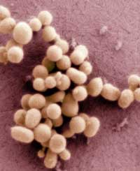
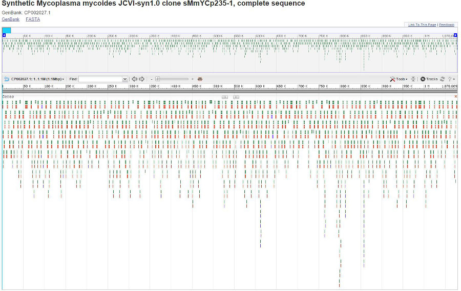

# Week 7. Genome Engineering

## Lecture video
Link to the [video lecture](https://vimeo.com/141798223)

## Assignment.  Make a set of rules for redesigning a bacterial genome based on biological knowledge and transposon bombardment data

According to wikipedia:
Mycoplasma laboratorium is a designed, partially synthetic species of bacterium derived from the genome of Mycoplasma genitalium. This effort in synthetic biology is being undertaken at the J. Craig Venter Institute by a team of approximately 20 scientists headed by Nobel laureate Hamilton Smith, and including DNA researcher Craig Venter and microbiologist Clyde A. Hutchison III. Mycoplasma genitalium was chosen as it was the species with the smallest number of genes known at that time.
First, visit NCBI and research for Synthetic Mycoplasma mycoides JCVI-syn1.0 clone sMmYCp235-1, complete sequence
Download genetic sequence in fasta format
Download genetic sequence in Gen Bank

UGENE
Download and install UGENE from: http://ugene.net/download.html
UGENE is free open-source bioinformatics software.It works on a desktop computer with Windows, Mac OS X or Linux.

UGENE helps biologists to analyze various biological data, such as sequences, annotations, multiple alignments, phylogenetic trees, NGS assemblies, and others. The data can be stored both locally (on a personal computer) and on a shared storage (e.g. a lab database).

UGENE integrates dozens of well-known biological tools and algorithms, as well as original tools in context of genomics, evolutionary biology, virology and other branches of life science. UGENE provides a graphical interface for the pre-built tools so biologists without programming skills can access those tools more easily.

Using UGENE Workflow Designer, it is possible to streamline a multi-step analysis. The workflow consists of blocks such as data readers, blocks executing embedded tools/algorithms and data writers. Blocks can be created with command line tools or a script. A set of sample workflows is available in the Workflow Designer (for annotating sequences, conversion of data formats, NGS data analysis, etc.)

Besides the graphical interface, UGENE also provides a command-line interface. A workflow made by the Workflow Designer can be executed using the command-line interface. In order to provide better performance, UGENE utilizes multicore CPUs and GPUs to optimize a few algorithms

## Assignment review
On Wednesdays we always have a review session of last week's assignment. Here is the link to this week [assignments review](https://vimeo.com/142399703).

---

## [<<](./w06.html)  [  home  ](./index.html)  [  >>](./w08.html)
