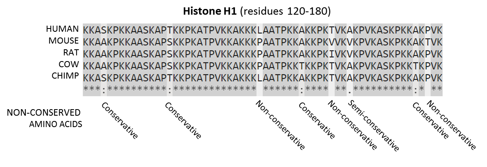
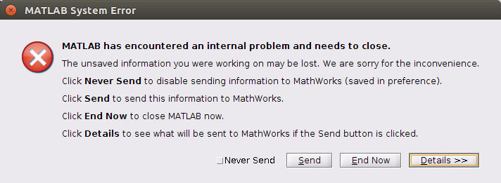

# Week 8. Fluorescence In Situ Sequencing (FISSEQ)

## Lecture video
Link to the [video lecture](https://vimeo.com/142401127)

## Assignments

### Computational assignment: Analyze a FISSEQ dataset and find some in situ sequences

#### Software installation
The first thing I did was requesting an [educational license](https://store.enthought.com/#canopy-academic) of **Canopy**. I had to create and account and explain why I wanted an educational account because the email I provided wasn't an `.edu` one. Actually I have and `.edu` email from my University [UPC](http://upc.edu), but I just wanted to find out how they consider us. In the end Canopy replyed that we (I guess fab labs) are not eligible for using the educational version and asked us to use the free Express edition instead for the assignment. You can do so if you want, I am not. Another student from [Cambridge, Boston](http://bio.academany.org/labs/cambridge/), Thras (Thank you man!) showed me that Canopy wasn't a piece of software, but a wrapper containing a Python environment with some packages. Here it is the [full list](https://www.enthought.com/products/canopy/package-index/) of software contained in Canopy, but I installed only what Thras said it was enough for this assignmnent. Under Ubuntu it's:
```bash
sudo apt-get install python-numpy python-scipy python-matplotlib python-biopython
pip install -U pillow
```

I also installed **R** and **Bowtie** from the Ubuntu software center. I [downloaded](https://www.rstudio.com/products/rstudio/download/) and installed **RStudio 0.99.489** for Ubuntu 64 bits. I also [downloaded](http://fiji.sc/Fiji) and installed  **Fiji ImageJ Distribution** for Linux 64. Instead of MATLAB I used the alternative GNU version called **Octave 4** (installed from Ubuntu software center) which is supposed to have high compatibility with MATLAB. We'll find out soon.

#### Bowtie: Aligning sequences to the human genome
I [downloaded](ftp://ftp.ncbi.nih.gov/gene/DATA/gene2refseq.gz) the **RefSeq-to-Gene ID Conversion Table**, a 2.9 GB uncompressed file and also downloaded (howto below) the **human RefSeq RNA FASTA** which was splitted into 24 files so it was required to extract-combine it and compile it:
```bash
wget ftp://ftp.ncbi.nih.gov/refseq/H_sapiens/mRNA_Prot/human.*.rna.fna.gz
gunzip -c human.*.rna.fna.gz > human.rna.fna
rm human.*.rna.fna.gz
bowtie-build -C -f human.rna.fna refseq_human
```
The Bowtie step takes quite a lot of time (around 54 minutes in my i5) and computing resources so I went to the website to see what's happening. From the [Bowtie website](http://bowtie-bio.sourceforge.net/index.shtml):

> **Bowtie is an ultrafast, memory-efficient short read aligner. It aligns short DNA sequences (reads) to the human genome** at a rate of over 25 million 35-bp reads per hour. Bowtie indexes the genome with a Burrows-Wheeler index to keep its memory footprint small: typically about 2.2 GB for the human genome (2.9 GB for paired-end).  

That brings me to wikipedia [Sequence Alignment](https://en.wikipedia.org/wiki/Sequence_alignment) entry:

>In bioinformatics, a **sequence alignment is a way of arranging the sequences of DNA, RNA, or protein to identify regions of similarity that may be a consequence of functional, structural, or evolutionary relationships between the sequences**. Aligned sequences of nucleotide or amino acid residues are typically represented as rows within a matrix. Gaps are inserted between the residues so that identical or similar characters are aligned in successive columns.  
(...)  
**If two sequences in an alignment share a common ancestor, mismatches can be interpreted as point mutations and gaps as indels** (that is, insertion or deletion mutations) introduced in one or both lineages in the time since they diverged from one another. In sequence alignments of proteins, the degree of similarity between amino acids occupying a particular position in the sequence can be interpreted as a rough measure of how conserved a particular region or sequence motif is among lineages. **The absence of substitutions, or the presence of only very conservative substitutions** (that is, the substitution of amino acids whose side chains have similar biochemical properties) in a particular region of the sequence, **suggest that this region has structural or functional importance**. Although DNA and RNA nucleotide bases are more similar to each other than are amino acids, the conservation of base pairs can indicate a similar functional or structural role.


[Histone Alignment" by Thomas Shafee - Own work. Licensed under CC BY-SA 4.0 via Commons](https://commons.wikimedia.org/wiki/File:Histone_Alignment.png#/media/File:Histone_Alignment.png)

The output of the Bowtie step are the following binary files:
```
refseq_human.1.ebwt
refseq_human.2.ebwt
refseq_human.3.ebwt
refseq_human.4.ebwt
refseq_human.rev.1.ebwt
refseq_human.rev.2.ebwt
```

#### Analysing with ~~MATLAB~~ Octave. A world of pain
For this step I [downloaded](http://arep.med.harvard.edu/FISSEQ_Nature_Protocols_2014/) and unzipped the **FISSEQ Nature Protocols (2014)** and also moved the output files from the Bowtie step to the `fisseq` folder. **Moment of truth now, trying Octave instead of MATLAB**:
```matlab
>> addpath('fisseq','fisseq/bfmatlab')
>> input_dir='decon_images/'
input_dir = decon_images/
>> output_dir='registered_images/'
output_dir = registered_images/
>> register_FISSEQ_images(input_dir,output_dir,10,0.1,1)
ans =  1
Initialize:
Elapsed time is 0.0993981 seconds.
error: 'loci' undefined near line 79 column 20
error: called from
    bfCheckJavaPath at line 79 column 13
    bfopen at line 99 column 8
    register_FISSEQ_images at line 66 column 4
error: evaluating argument list element number 1
error: called from
    bfCheckJavaPath at line 79 column 13
    bfopen at line 99 column 8
    register_FISSEQ_images at line 66 column 4
>>
```
Too easy to be true. So I go to line 79 in the `bfCheckJavaPath.m` file which says `version = char(loci.formats.FormatTools.VERSION);`. A Google search for `loci octave` [brings me to a forum](https://www.openmicroscopy.org/community/viewtopic.php?f=13&t=7530) where someone says that [Bio-Formats](http://loci.wisc.edu/software/bio-formats) for Matlab might not be fully compatible with Octave. So I'm now stuck here trying to refuse the fact that I will need to use MATLAB in the end.

> **What's the point of trying to do it in Octave? Why don't you just do it in MATLAB? You are wasting your time**  
>
> These are common comments I receive now and back in 2003, during Fab Academy, when I was using Kokopelli instead of Eagle for designing circuit boards. I'll try to answer: It is not about Octave or Kokopelli. It's about the challenge, about exploring the unknown, the call for doing something that has been never done before. If you don't feel this need you are missing a gene, because [there is a gene for that](http://ngm.nationalgeographic.com/2013/01/125-restless-genes/dobbs-text).

And when all seemed lost, I stared at defeat and [found hope](https://lists.gnu.org/archive/html/help-octave/2015-09/msg00136.html). **There is a bio-formats version for Octave**. You will not find it listed in the [downloads section](http://downloads.openmicroscopy.org/bio-formats/5.1.7/). But it is [there](http://downloads.openmicroscopy.org/bio-formats/5.1.7/artifacts/bioformats-octave-5.1.7.tar.gz), release after release, hidden, waiting... So there we go for the installation. This is for version 5.1.7 but there might be a newer version. [Check it](http://downloads.openmicroscopy.org/bio-formats/) and change the numbers accordingly:

Download and install the latest bioformat java package. According to Carnë Draug  _This mimics how java packages are installed by Debian. The actual jar has the version on the filename, while the unversioned filename is a symbolic link to a specific version. This allows you to have multiple versions installed while keeping one (usually the latest) as the default_:
```bash
sudo mkdir /usr/local/share/java/
sudo wget http://downloads.openmicroscopy.org/bio-formats/5.1.7/artifacts/bioformats_package.jar -O /usr/local/share/java/bioformats_package-5.1.7.jar
sudo ln -s bioformats_package-5.1.7.jar /usr/local/share/java/bioformats_package.jar
```
Create a file named `javaclasspath.txt` in your home directory and add the path to the bioformats_package.jar file.
```bash
touch ~/javaclasspath.txt
echo "/usr/local/share/java/bioformats_package.jar">>~/javaclasspath.txt
```
Download the latest bioformat package and inside Octave prompt navigate to the downloaded file and install it.
```matlab
>> cd ~/Downloads
>> pkg install bioformats-octave-5.1.7.tar.gz
```
We are not yet done. `containers.Map` is not yet implemented in Octave so we need to change some lines in the file `register_FISSEQ_images.m` according to [this stackoverflow entry](http://stackoverflow.com/questions/11622084/converting-matlab-to-octave-is-there-a-containers-map-equivalent). Replace this:
```matlab
mapObj = containers.Map(strsplit(layout_order,' '),strsplit(layout_size,' '));
x = str2num(mapObj('x'));
y = str2num(mapObj('y'));
z = str2num(mapObj('z'));
```
With this:
```matlab
mapObj = struct();
for i=1:numel(strsplit(layout_order,' '))
    mapObj.(strsplit(layout_order,' '){i}) = strsplit(layout_size,' '){i};
end
x = str2num(mapObj.('x'));
y = str2num(mapObj.('y'));
z = str2num(mapObj.('z'));
```

 And there we go again with Octave:
```octave
>> cd ~/Downloads/w8
>> addpath('fisseq')
>> input_dir='decon_images/'
input_dir = decon_images/
>> output_dir='registered_images/'
output_dir = registered_images/
>> pkg load bioformats
>> register_FISSEQ_images(input_dir,output_dir,10,0.1,1)
```

---

**This is it for Octave. I give up**, I need to finish the assignment so I am going to install MATLAB. It _almost_ works. But you can't go anywhere with _almost_.
 For future reference this is how far I reached. I'm getting two messages. One message continuosly: `Unknown ExperimentType value 'null' will be stored as "Other"` and an error at the end `error: register_FISSEQ_images: A(I,J,...) = X: dimensions mismatch`. I have been in conversations with Carnë Draug and some Octave and Bioformats developers trying to resolve this issue.

**First:** Bioformats under Octave is working fine. Meaning you can open an `.ics` file correctly. If you for example try with this file  <http://www.loci.wisc.edu/files/software/data/qdna1.zip>, you can open the image doing the following workflow (edited from Carnë Draug):
```
$ octave
octave> pkg load bioformats
octave> ls
qdna1.ics  qdna1.ids  readme.txt
octave3> bf_img = bfopen ("qdna1.ics");
ICSReader initializing /home/username/Downloads/qdna1/qdna1.ics
Finding companion file
Checking file version
Reading metadata
Populating core metadata
Populating OME metadata
Unknown ExperimentType value 'null' will be stored as "Other"
Reading series #1
   .
octave> imshow (bf_img{1}{1})
```
**Second:** There is something else that needs to be changed in register_FISSEQ_images.m to be compatible with Octave. It complains in line 148. `error: register_FISSEQ_images: A(I,J,...) = X: dimensions mismatch`. According to Carnë Draug the error might be caused because _(...) note that unlike **imread()**, **bfopen()** does not return an N dimensional
array. It returns a 4 cell array. It's a bit tricker to handle._  But to be honest I have no idea how to move from here.

#### Analysing with MATLAB 2015a Linux version
Here we go again. I Installed MATLAB R2015a, Bioformats for MATLAB and started working again on the script. And then:



When I saw this I holded the breath for the longest time in my entire life. Probably more than a minute. It looks like I cannot complete the computational assignment with my combination of software/hardware.

**Update:** I am working towards this goal after HTGAA.

### Design Assignment

#### Were there any experiments in HTGAA so far, where in situ data of RNA, DNA, protein, or other cellular features would be helpful in understanding the engineering process?
Well I have to admit that this assignment is totally out of my understanding scope. But I think in bio production could be helpful to understand which DNA and RNA elements are active during the process of production of the elements we want to produce.

#### What are some reasons in situ data could be better than bulk data for this experiment? Try to think of cases where a bulk measurement would cause you to miss some insight.
In situ data has the capability to consider environment and relation betweeen different cells and conditions. Bulk data on the other hand does not consider those natural conditions.

#### What kinds of molecules would you like to detect? E.g. what species of RNA? How would you go about targeting those molecules?
I know they would be mRNA and DNA. But no idea on how to target them.

#### What factors would limit your ability to detect the things you are interested in?
Apart from my scarce knowledge. We could not see it tri-dimensionally, only bi-dimensionally. And also that the process kills the cell. So it would be limiting if the survival of the cell would be required to analize another future process in the cell.


### Lab assignment: Create an in situ sequencing library inside a polyacrylamide hydrogel, and detect the sequencing amplicons using fluorescent sequencing by hybridization
We tried to do this experiment but I we couldn't do it. **To be honest I think that the lab assignment is out of the scope for a fab lab**. I think so because even using the resources of the PRBB (Biomedical Research Park of Barcelona) this assignment could not be completed. The required materials were not there and the cost of buying them was unfordable for us. And through the vision of a fab lab taking students, **I wonder how are we going to deal with this since the cost of the required materials for this experiment is about a quarter of what you get per student**. Just the materials.

## Assignment review
On Wednesdays we always have a review session of last week's assignment. Here is the link to this week [assignments review](https://vimeo.com/143154714).

---

## [<<](./w07.html)  [  home  ](./index.html)  [  >>](./w09.html)
