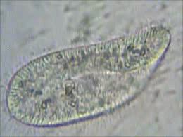
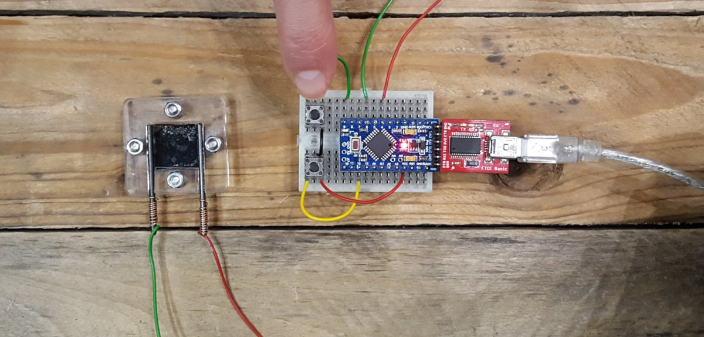
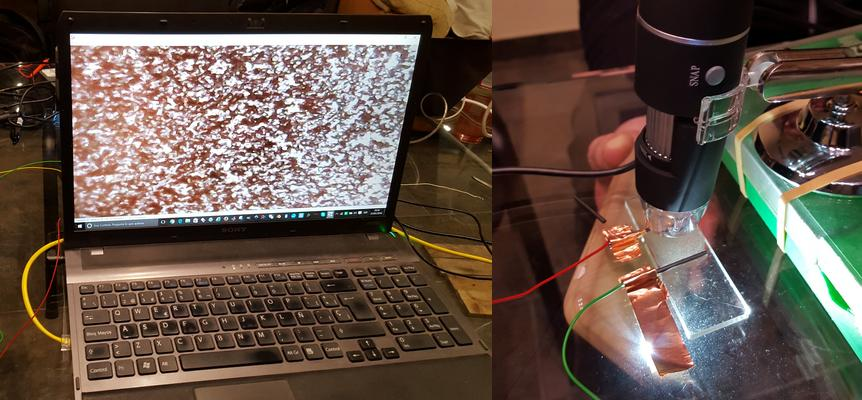

# Week 9. Synthetic development biology

## Lecture video
Link to the [video lecture](https://vimeo.com/143155993)

## Lab assignment: Build a Paramecium/Arduino interface. Measure how fast the paramecia (a) swim and (b) change direction in response to electrical stimulation
I have to admit that **we had a lot of fun doing this experiment, but it was a nightmare to find Paramecium**. We tried to fin it in natural ponds and we saw nothing. We tried to grow it locally with no success at all. We asked some people in the US and they replied Spain was too far (so whaaaat???). We tried to buy it from the European website and our credit card was constantly declined. Finally Marc found a friend of him who was growing them and we could do the experiment. And I wonder: **How come this microorganism who has been here for millions of years and it is supposed to be present everywhere you look it's so difficult to find?**

[Paramecium](https://en.wikipedia.org/wiki/Paramecium) refers to a unicellular ciliated (meaning they are covered with a hair-like organelle that they use to move) protozoan. It is widely used in classrooms and laboratories to study biological processes since they can be easily induced to conjugate and divide. They are ovoid or cigar-shaped and measure between 50 and 300 micrometers.

In wikipedia I discover interesting stuff about Paramecium: _It has been calculated that a **Paramecium expends more than half of its energy in propelling itself through the water. Its method of locomotion has been found to be less than 1% efficient**. This low percentage is, nevertheless, close to the maximum theoretical efficiency that can be achieved by an organism equipped with cilia as short as those of Paramecium._

Regarding the assignment, the goal is placing paramecia in between electrodes in a setup that facilitates imaging. [Here](http://making.do/paramecium/build.html) is an example build, but I designed and fabricated another one in acrylic, shown below. It is very nice as you can see but the water leaked everywhere LOL so in the end we could not use it.

### Attempt One. 9V bare copper
We started manually with a 9V battery. I was looking at the microscope, Adolfo was holding the battery and Marc had the bare electrodes (no graphite). It was very fun, three people for a single task. When we put the electrodes into the water there were a lot of bubbles coming out of the electrodes. The paramecium at first looked like they were shaking but then they stopped moving. Probably it was to much voltage. Now they don't move at all, I think they are all dead.

### Attempt Two. Now with graphite
Then we realised that the graphite has the functionality of spreading the electric energy across a bigger surface in order not to kill the microorganisms. I think they said it in class, we should have paid more attention. This is the actual _device_ we finally used because the very cool looking one was leaking everywere (now Adolfo's house is full of Paramecium).

We realised that with voltage applied the paramecium moved slower. I always had thought that they would move faster when voltage would be applied. Also the randomness of the movement decreseases and becomes more linear. And appparently, but it is too subtle to say this aloud, they seem to be moving towards we applied the ground. Finally we repeated this experiment again with 9V.

### Conclussion
Paramecium swim slower when a 5V voltage drop is applied to the water. Also the movement becomes less random and linear, moving apparently towards the negative electrode. When the voltage is released they recover their original behaviour quickly.  

At 9V the paramecium swim even slower than at 5V. But at some point they behave strangely, moving in circles even when voltage is removed. And finally they probably die if the voltage is not removed.

<iframe width="960" height="720" src="https://www.youtube.com/embed/eZhVWbMzDvE?rel=0&amp;showinfo=0" frameborder="0" allowfullscreen></iframe>

## Assignment review
On Wednesdays we always have a review session of last week's assignment. Here is the link to this week [assignments review](https://vimeo.com/143885871).

---

## [<<](./w08.html)  [  home  ](./index.html)  [  >>](./w10.html)
