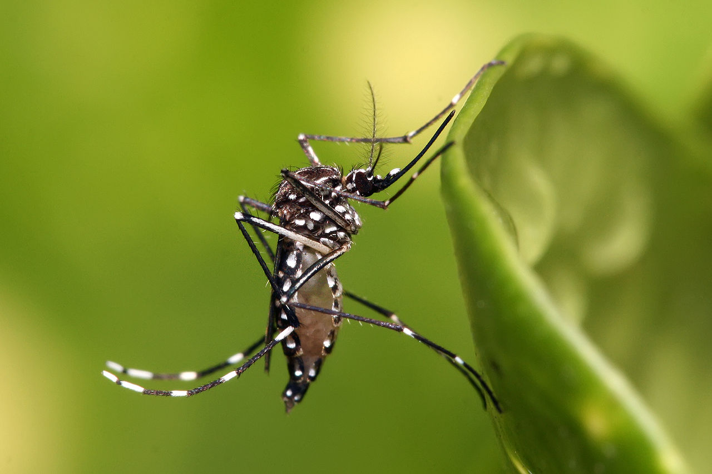

# Week 11. Gene Drives & Synthetic Ecosystems

## Lecture video
Link to the [video lecture](https://vimeo.com/144647180)

## Assignments

### Creative assignment

#### What features would you want to see in an online discussion platform devoted to guiding the development of gene drives? Assume that the researchers involved in the project are interested in soliciting public feedback before and during experiments so that they can better identify problems and redesign the technology. Please give specific examples of already-existing elements – if you want a discussion forum, should it be more like reddit, Quora, or something else? What should moderation be like?
Definitely not reddit! Not even Quora. Actually I didn't know Quora and I tried to browse it and it was a pain. You need to create an account before actually seeing anything. It asked me 3 times to put my real name when it was already there. **It should be something less agressive, that you can browse and search content without the need to setup an account**. And when you want to participate or for accessing some channels you have to create an account. I imagine something more like a forum (well, that a little bit old now) maybe an updated version of that. Regarding moderation, I think it should have passive moderators -that is, people is free to talk and they only act when there is something wrong- like in a forum to keep the quality of the discussion high and to point people like me to the correct channel. But not something like moderated comments that the moderator has to previously approve to appear.

#### What would it take to get you to regularly participate in such a community?
Say that I talk on behalf of a typical fab lab person, that has little synthetic biology knowledge but a lot of interest in the field. In my case, **I would participate in such a community if there is a place for me**. Meaning the community has an educational/newbie/entry level channel where I can grow and discuss with people like me and some other people about this themes of interest. And of course it should have a smartphone app.

### Design assignment

#### Identify a problem that could be addressed using a CRISPR gene drive.
The yellow fever mosquito (Aedes aegypti) is a mosquito that can spread dengue fever, chikungunya, zika fever and yellow fever viruses, and other diseases.

The mosquito can be recognized by white markings on its legs and a marking in the form of a lyre on the upper surface of the thorax. The mosquito originated in Africa but is now found in tropical and subtropical regions throughout the world.

I would address my research about Dengue

Dengue fever, also known as breakbone fever, is a mosquito-borne tropical disease caused by the dengue virus. Symptoms include fever, headache, muscle and joint pains, and a characteristic skin rash that is similar to measles. In a small proportion of cases, the disease develops into the life-threatening dengue hemorrhagic fever, resulting in bleeding, low levels of blood platelets and blood plasma leakage, or into dengue shock syndrome, where dangerously low blood pressure occurs.

Epidemiology of dengue: past, present and future prospects

Dengue is currently regarded globally as the most important mosquito-borne viral disease. A history of symptoms compatible with dengue can be traced back to the Chin Dynasty of 265–420 AD. The virus and its vectors have now become widely distributed throughout tropical and subtropical regions of the world, particularly over the last half-century. Significant geographic expansion has been coupled with rapid increases in incident cases, epidemics, and hyperendemicity, leading to the more severe forms of dengue. Transmission of dengue is now present in every World Health Organization (WHO) region of the world and more than 125 countries are known to be dengue endemic. The true impact of dengue globally is difficult to ascertain due to factors such as inadequate disease surveillance, misdiagnosis, and low levels of reporting. Currently available data likely grossly underestimates the social, economic, and disease burden. Estimates of the global incidence of dengue infections per year have ranged between 50 million and 200 million; however, recent estimates using cartographic approaches suggest this number is closer to almost 400 million. The expansion of dengue is expected to increase due to factors such as the modern dynamics of climate change, globalization, travel, trade, socioeconomics, settlement and also viral evolution. No vaccine or specific antiviral therapy currently exists to address the growing threat of dengue. Prompt case detection and appropriate clinical management can reduce the mortality from severe dengue. Effective vector control is the mainstay of dengue prevention and control. Surveillance and improved reporting of dengue cases is also essential to gauge the true global situation as indicated in the objectives of the WHO Global Strategy for Dengue Prevention and Control, 2012–2020. More accurate data will inform the prioritization of research, health policy, and financial resources toward reducing this poorly controlled disease. The objective of this paper is to review historical and current epidemiology of dengue worldwide and, additionally, reflect on some potential reasons for expansion of dengue into the future.

#### Which organism would you target and how would you alter it?
Aedes aegypti. Blocking the ability for the virus to reproduce in the mosquito.
"Heritable CRISPR/Cas9-Mediated Genome Editing in the Yellow Fever Mosquito, Aedes aegypti."
DOI: 10.1371/journal.pone.0122353

#### Why is a gene drive a good solution relative to other options?
Because it will be reduced the quantity of mosquitos which bring dengue. Obviously, a mutation could complicate the nowadays situation about Dengue.

#### What could go wrong? Don't go into detail, but list several possibilities.
Become the mosquito more active, increase mosquito population, become more dangerous the illness, etc.

#### Who should be involved in the discussion of whether to consider this application?
Health authorities of all the countries were are Dengue.

## Assignment review
On Wednesdays we always have a review session of last week's assignment. Here is the link to this week [assignments review](https://vimeo.com/145411576).

---

## [<<](./w10.html)  [  home  ](./index.html)  [  >>](./w12.html)
