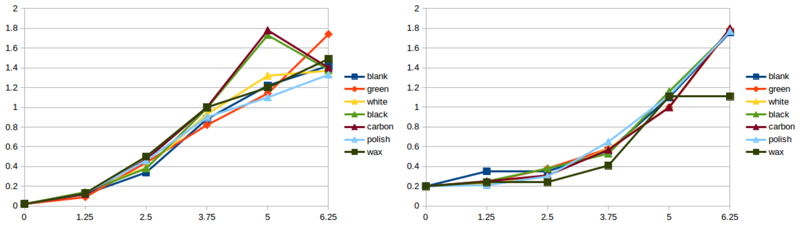
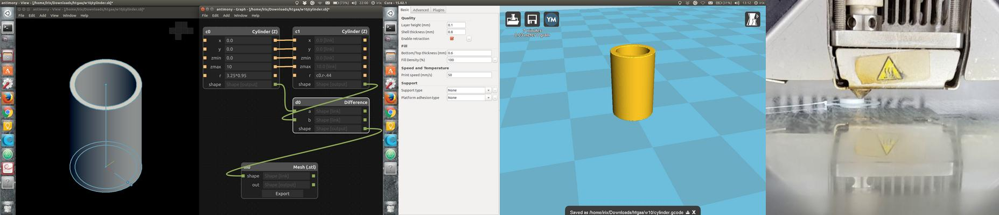

# Week 12. Engineering the Human Microbiome

## Lecture video
Link to the [video lecture](https://vimeo.com/145416831)

## Assignments

### 3D print a 14 mL culture tube in at least one material. Culture a bacterial strain of your choice in this tube and compare the growth rate (optical density) over time versus a polystyrene control tube

#### 3D Printing the culture tube
I downloaded the [3D model](./files/w12/14mL-Tube.zip) test tube and cap from David Kong's Microfluidic profile. I also created an account (beachlab) for later uploading my designs. When you are slicing the STL (I am using Cura from Ultimaker) **make sure that you use a 100% fill density**. Otherwise it probably won't be watertight. The intention was to 3D print a couple of tube/cap in different materials using an Ultimaker 2 3D printer. Unfortunately the Ultimaker 2 power supply broke in the middle of the 3D printing when the print was like this:

 

**Houston... we have a problem:** We don't have the tube and we don't have time to print it in another place either. So now we are going to run two parallel experiments using the same principle used by the Swiss team. We are going to introduce different materials, including 3D printing filament and others, inside sterilized containers and measure the anomaly in growth rate over time versus a blank control tube. Here we go.

#### Experiment 1. Manual readings
**NOTE:** What you are going to whitness now for this assignment is way too much. First of all, **you don't need to do as many material cases as we did**. But second and most important, with so many tubes, handling, pipetting, measurements and notes **there is an exponential risk of making mistakes**. Actually we got some atypical readings (as you will see later in the results) which I consider that were caused by the mess of the whole process. So if you are reading this for next year, focus in a maximum of 2 ~~or 3~~ materials only. We did all these materials:

* Green PLA/PHA from
<http://colorfabb.com/intense-green>
* White PLA/PHA from
<http://colorfabb.com/bluish-white>
* Black XT from
<http://colorfabb.com/xt-black>
* Black Carbon from
<http://colorfabb.com/xt-cf20>
* IKEA candle wax
* Cheap Nail Polish

This is insane, seriously. Never do that, or at least never show it to me.

#### Conclussion
After 6 painful hours, we did not observe any difference in growth. Which is weird actually. We had a few atypical readings as you can see in the graphs below, but nothing of significance. We expected to see clear differences in growth at least in the most toxic components. Spreadsheet attached [here](./files/w12/manual.xlsx)

#### Experiment 2. Automated readings
Inside the PRBB there is an automatic turbidimeter which incorporates incubator and shaker and takes a 96 well plate measuring automatically the optical density over time. The researchers here call this machine _the cricket_ because of the noise the machine makes when it's reading the wells. Actually **this is a nice machine to replicate with open hardware**.

So we designed a few cylinders Antimony in order to be as thin as possible and to fit as tight as possible in the 96 well plate. And we 3D printed them in **white PLA** and **black ABS** using Valldaura's Ultimaker 2.

We also rub the walls of some wells with IKEA's candle wax and paint the walls of some other wells with nail polish. And then we let in the _cricket_ for 25 hours.

#### Conclussion
As you can see in the image below we did not observe any difference in growth apart from that nail polish. Spreadsheet attached [here](./files/w12/automated.xlsx)

### Design a milli- or micro-fluidic _artificial gut_ or other _organ-on-a-chip_ device to be utilized, at a minimum, for cell culture
**I got the inspiration looking at the pattern of a microfluidic device called [hoope](http://www.hoope.io/)**. I will use a **similar pattern to fabricate a dual gut for testing differences in growth of two different cultures** or the same culture with different _Lysogeny Broth_ (LB).

I am going to design the device with a piece of software that we use in Fab Academy. It's called **Antimony** ([github project here](https://github.com/mkeeter/antimony)), under (heavy) development by Matt Keeter. The reason why I am using this and no other software is because ~~I'm a freak~~ Antimony is parametrical and once you create one model you can create many variants by just modifying a few parameters. I don't think it is going to work as expected at the first try so **it is better to spend a little bit of extra time now to save a lot later**.

<video width="100%" autoplay loop>
 <source src="./img/w12/antimony.mp4" type="video/mp4">
Your browser does not support the video tag.
</video>

This device will have a top and a bottom part with 3 inlets and 2 outlets. Because this microfluidics device is designed to grow cultures I didn't want to use any glue or chemicals to join the top and bottom parts so I designed holes for mechanical fixation using M2 screws and nuts.

Please find [here](./files/w12/microfluidics.sb) the `microfluidics.sh` original antimony design (the channels). Later I used **Inkscape** to create the cutting paths for the acrylic and the holes. And here it is the final design.

### Fabricate your device, or at least one component of your device
I fabricated the device using a Full Spectrum 45W laser cutter and transparent acrylic, 3mm width. The channels are made rastering an image at 100% power and 50% speed. The cutting was made following a vector path at 100% power and 20% speed. Actually these settings are not a very good reference because the laser beam is not well aligned and it requires more power.

This is the prototyped design. Unfortunately I don't have any luer to show the functionality. If you look at the microscope the raster section you will see that it is quite rough. This is because my laser cutter is 3500 USD and a good one is 35000 USD. Donations are welcome.

### Share your _final_ device designs on _Metafluidics_
You can find the uploaded design [here](http://metafluidics.staging.wpengine.com/devices/culture-chip/). It is called _Culture Chip_ and my username is _beachlab_.

## Assignment review
On Wednesdays we always have a review session of last week's assignment. Here is the link to this week [assignments review](https://vimeo.com/146139576).

---

## [<<](./w11.html)  [  home  ](./index.html)  [  >>](./w13.html)
