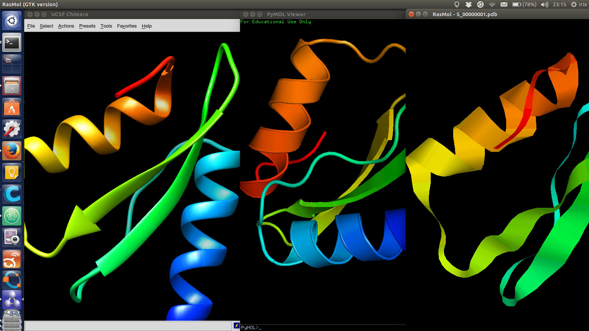
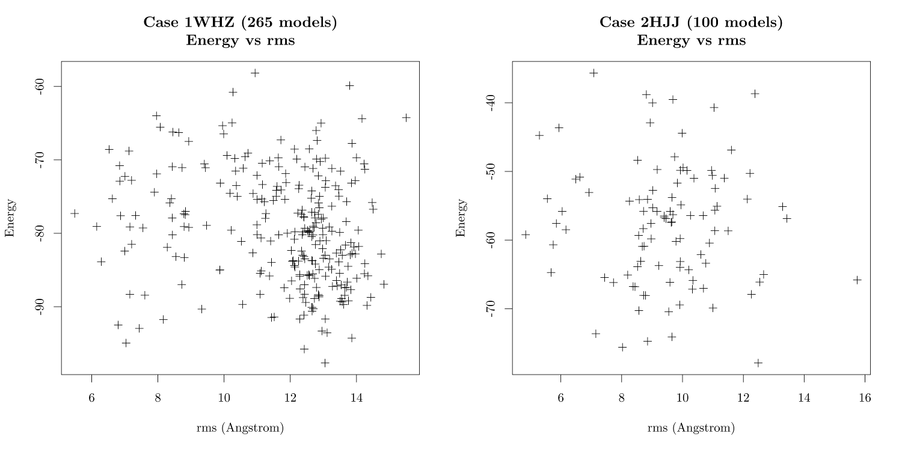
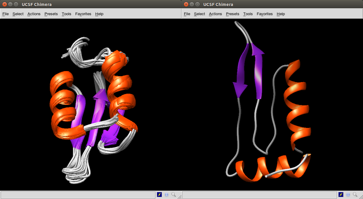
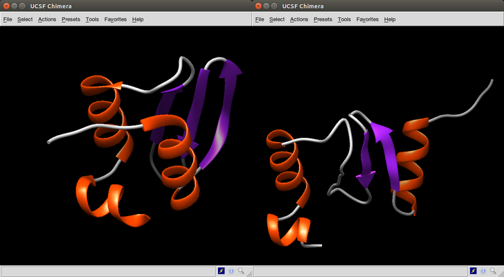
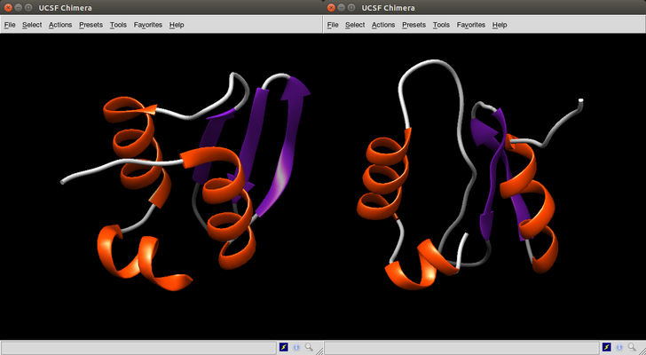

# Week 13. Bio molecule sensors

## Lecture video
Link to the [video lecture](https://vimeo.com/146156498)

## Assignment: Run the Rosetta protein structure prediction simulations and analyze the results

### Molecule viewers review
For this assignment I will install and review all three molecule viewers. First I installed **RasMol 2.7.5.2 (GTK version)** from the Ubuntu software center. Also I [requested an educational license](http://pymol.org/) of **PyMOL 1.7.4** for Linux 64 bit (automatic process where you will obtain a user and password to download it). Extract PyMOL and run it from the created folder in a terminal window `./pymol`. Finally I [downloaded](https://www.cgl.ucsf.edu/chimera/) **Chimera 1.10.2** for Linux 64 bit. The installation process of Chimera in Ubuntu is slightly different since it is a `.bin` file. You have to allow execution of the file (either with `chmod 755 chimera_filename.bin` or changing the permissions in File Properties) and then running `./chimera_filename.bin` in a terminal window. Also running Chimera is a bit messy since you have to run it from where the program is installed, in my case `~/.local/UCSF-Chimera64-1.10.2/bin/chimera`.

In terms of the installation process, RasMol is much easier and convenient to install than the others. And you don't need to mess with educational licenses requests. Regarding the interface, that is, the GUI, PyMOL looks awkward with so many windows and options. Chimera has in my opinion a better arrangement of the options but the window management system looks like [Motif](https://en.wikipedia.org/wiki/Motif_Window_Manager) from the 80's or even older. But when it comes to features and visual quality of the molecules RasMol starts loosing many points. Chimera has by far the best visual quality followed by PyMOL. In features probably both are similar but I feel them easier to find in Chimera. Overall, this is my personal comparison table for all three:

Aspect | RasMol | PyMOL | Chimera  
 --- | --- | --- | ---
  Installation | Easy | Normal | Annoying  
  GUI | Nice | Messy | Old  
  Features | Fewer | Many | Many
  Visual quality | Poor | Good | Very good

My personal pick for this assignment? **Chimera**. Also installed [Foldit](https://fold.it), a protein folding game. But I still don't know why. I missed the lecture and I have to review the video in-depth.



### Plot the score (or energy) vs rms plot
I'm starting with case `2HJJ`, so I modify the `abrelax_flags` file in this folder changing the path to the database folder relative to the abrelax file `-database ../database/`. I keep the number of models to 100 `-nstruct 100` to see how much time it takes. My hardware is Intel i5 M520 @2.4GHz x4 and 5.5Gb of RAM.

 I run `../executable/AbinitioRelax.static.linuxgccrelease @abrelax_flags` from terminal in the `2HJJ` folder. It is taking about 3 to 4 minutes to generate one model (each one of the `S_00000#.pdb` files) in my computer. So the estimated time for a hundred models should be 300 to 400 minutes (so about 5 to 6 hours). I'll come back later.

(a few hours later...)

It actually took 5 hours and 16 minutes to generate the 100 models, that makes an average of 3.16 minutes per model. I am now going to compute case `1WHZ` to generate as many models as I can until tomorrow Monday at 08:00. It is now Sunday 18:00, so I have 14 hours, that is 840 minutes. So 840/3.16=265 models using the same workflow as above.

I don't understand. When I checked this morning at 8:00 only 225 models had been computed. In the end it took 16 hours and 18 minutes to generate them all, an average of 3.69 minutes per model. I was wondering why the average had changed until I heard an internal voice: _Because you are computing another model you moron_.

**Let's plot the test cases** now, I am going to use R for processing the scatterplot and [tikzDevice](http://texample.net/tikz/examples/tikzdevice-demo/), a R package for creating a nice output using [TikZ](http://www.texample.net/tikz/), which is something I used in the University when I was typesetting documents in [LateX](https://www.latex-project.org/). For that we first need to install something in **R**.
```r
> install.packages("filehash")
> install.packages("tikzDevice", repos="http://R-Forge.R-project.org")
```
The data file we want to plot is `score.fsc`, a text file containing a table whose cells are separated by blank characters. It has as many rows as models plus a header row and 29 columns. We are plotting column `score` vs column `rms`. I created a **R** script to generate a PDF plot for each test case:
```r
# GENERAL
require(tikzDevice)
# CASE 2HJJ
setwd("~/Downloads/w13/homework/structure_prediction/2HJJ/")
case2hjj <- read.table("score.fsc", header = TRUE)
tikz('case2hjj.tex',standAlone = TRUE, width = 5,height = 5)
plot (case2hjj$rms, case2hjj$score, main="Case 2HJJ (100 models)\nEnergy vs rms", xlab="rms (Angstrom)", ylab="Energy", pch=3)
dev.off()
tools::texi2dvi('case2hjj.tex',pdf=T)
# CASE 1WHZ
setwd("~/Downloads/w13/homework/structure_prediction/1WHZ/")
case1whz <- read.table("score.fsc", header = TRUE)
tikz('case1whz.tex',standAlone = TRUE, width = 5,height = 5)
plot (case1whz$rms, case1whz$score, main="Case 1WHZ (265 models)\nEnergy vs rms", xlab="rms (Angstrom)", ylab="Energy", pch=3)
dev.off()
tools::texi2dvi('case1whz.tex',pdf=T)
```
To generate the plots yourself [download here](./files/w13/w13.R) the script, adjust the paths and type `source("w13.R")` inside the **R** prompt.



Above are the graphics generated by the scripts, combined into a single image using the command line tool `montage -density 2000 -geometry 1000 case1whz.pdf case2hjj.pdf comparison.png`

### Pick the lowest energy model and structurally compare it to the native. How close is it to the native? If its different, what parts did the computer program get wrong?.

#### Case 2HJJ
In the **R** environment, we can find the minimum value of the score column and where is it located with the commands `min` and `which.min`:
```r
> min(case2hjj$score)
[1] -77.924
> which.min(case2hjj$score)
[1] 44
```
So let's view case 44 using Chimera and compare it with the native molecule.



#### Case 1WHZ
We repeat the same steps as above for case 1WHZ. Remember that for this case we computed 265 models.
```r
> min(case1whz$score)
[1] -97.672
> which.min(case1whz$score)
[1] 100
```



### Pick the lowest rms model and structurally compare it to the native. How close is it to the native? If its different, how is it different?

#### Case 2HJJ
As we did before, in the **R** environment, we can find the minimum value of the rms column and where is it located with the commands `min` and `which.min`:
```r
> min(case2hjj$rms)
[1] 4.843
> which.min(case2hjj$rms)
[1] 8
```
Viewing case 8 using Chimera and comparing it with the native molecule.


#### Case 1WHZ
We repeat the same steps as above for case 1WHZ. Remember that for this case we computed 265 models.
```r
> min(case1whz$rms)
[1] 5.485
> which.min(case1whz$rms)
[1] 223
```



## Conclussion
What it can be appreciated is that the **lowest rms models are more accurate than the lower energy models**. Actually some low energy models share very little in common with the real model. 

## Assignment review
On Wednesdays we always have a review session of last week's assignment. Here is the link to this week [assignments review](https://vimeo.com/147616270).

---

## [<<](./w12.html)  [  home  ](./index.html)  [  >>](./w15.html)
