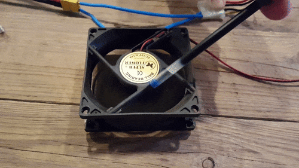
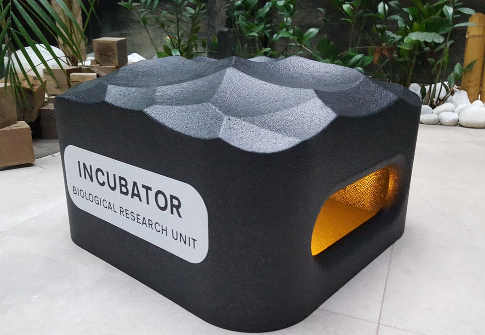
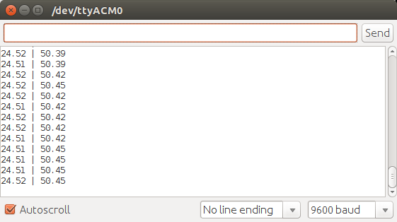
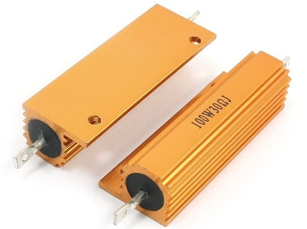
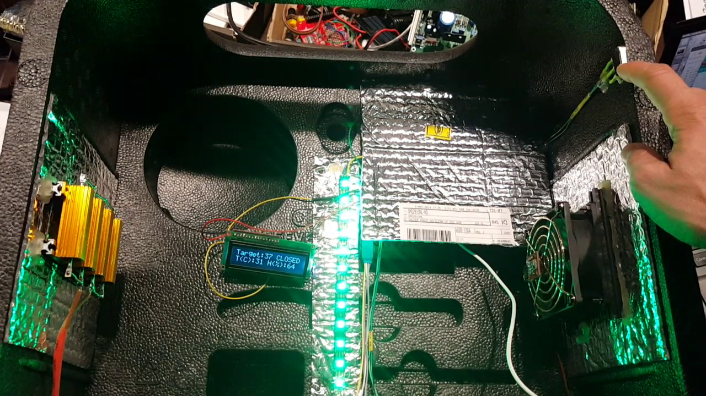

# Week 15. Tool Chains, Automation and Open Hardware

## Lecture video
Link to the [video lecture](https://vimeo.com/147617792)

## The comeback
I spent the last 5 weeks in India and Dubai teaching an [experimental course](http://thebeachlab.github.io) designed for fab academy potential students. During that trip I learned a lot of new things like [better  ways to write documentation](./doc.html). But on top of that it was an intense lifetime experience.


When I came back to The Beach Lab I found that most of my students are now either working from Barcelona Green Fab Lab or abandoned the course. So I am facing the last few weeks of HTGAA alone. I am also designing a **catch up plan** with the help of the [videos](https://vimeo.com/fabacademy) (thanks so much Zaerc) and the documentation that other students posted online. The goal this week is to complete weeks 15 and [13](./w13.html).

## Assignment: Now this I can do
The assignment [this week](http://bio.academany.org/doc/tool_chains) is to **design and build a piece of open hardware for biology**. For the first time in HTGAA I feel like I will be able to complete the assignment on time.

### Thinking what to do
I have to be **realistic** now, I'd like to build one of these complex pieces of lab equipment but my time is **limited**, this is a fact. Also I'd like to incorporate this piece of hardware to my final project and due assignments. This is a list of hardware needed for the assignments:

Hardware | Assignments | Open Source Version | Comments
--- | --- | --- | ---
PCR | w8 | OpenPCR | Hard
Shaking Incubator | w3, w8 , w12 | | Useful  
Fluorimeter | w3 | | Hard
Vortex Mixer | w3 | | Easy
Fluorescence Microscope | w8 |  | >40x Cy3 Cy5
Centriguge | w10 | | Useful
Spectrophotometer | w12 | | Hard
UV Irradiator | w12 | | Easy
Eppendorf Biophotometer | w12 | | Hard

After discussing with Adolfo, he will fabricate a microscope and I decided to fabricate an **Incubator** and a **Vortex Mixer**, and probably in the future a **Hard disk centrifuge**.

### Project #1: Vortex Mixer
This is an easy to do, but useful piece of equipment. You just need a salvaged computer fan and 12V power source. The blades will mix the solution while hitting the Eppendorf tube. Below I am simulating the effect with a pen since I don't have any Eppendorf tube.



### Project #2: Incubator
This was quite unexpected since I considered the project rather complicated with all the insulation but then I found a foam box from a 3d printer enclosure which is really good looking and already has a peep hole on it. I started reading [Hacteria's DIY Incubator](http://hackteria.org/wiki/DIY_Incubator). My version of the incubator will have the following features:

* Arduino controlled  
* [SHT15](https://www.sparkfun.com/products/retired/8257) temperature and humidity sensor  
* [Neopixel](https://www.adafruit.com/products/1138) RGB LED lighting  
* Relay activated Fan air recirculation  
* Relay activated Power resistor heating elements
* Lid Switch  

Future features:

* Rotary encoder for settings
* Orbital shaking bed  
* Internal camera  
* CO2 sensor and supply  
* Piezo buzzer Alarm
* Timer

#### The sticker
**Do not underestimate the value of a sticker**, specially when you are fabricating a piece of hardware that no one  knows what it is, except you. I created the text in Inkscape using [Transport Font](http://www.cbrd.co.uk/fonts/), exported to a 500 dpi `.png` image and cutted with the Vinyl cutter using [Fab Modules](http://fabmodules.org).



[Link to `.svg` design file](../files/w15/incubator.svg)

#### Testing the SHT15 sensor
I started hooking an Arduino Leonardo to the SHT15 sensor and uploading [this code](http://bildr.org/2012/11/sht15-arduino/). It took me a while to get it working. First I had to execute Arduino IDE 1.6.6 as root (`sudo ./arduino`) and select the `/dev/ttyACM0` port, otherwise it wasn't working. I have to find out why. The good news are that I started getting readings.



#### How much heating power is needed?
The **internal volume of the incubator** is 35x35x15 cm, which **is about 18 liters**. That volume of air **at 20ºC weights around 22g**. Dry air has a specific heat of `1J/(g ºC)`. **For a target temperature of 37ºC**, we need to increase the temperature by 17ºC and that will cost 374J. Given that `P(W)=E(J)/t(s)` (being `P(W)` power in Watts, `E(J)` energy in Joules and `t(s)` time in seconds) and assuming we want to reach the target temperature in **one minute** (60s), **the heat power needed is 374J/60s=6W**.



Now, let's see what a power resistor with a power rating of 50W -this is the maximum amount of power that can be safely dissipated without being damaged- and 15 Ohm would dissipate at 12V. First we use Ohm’s law `V = I × R`, to find the current through the resistor, `12 = I x 15` which turns out to be `I = 0.8A`. Then, we can use the power rule `P = I × V` , to find the power dissipated by the resistor, `P=0.8 x 12 = 9.6W.

#### Calculating the heat loss
Ideally, in a perfectly insulated incubator, once we reach the target temperature we could turn off the heat source and the temperature would remain constant over time. Obviously, this is not going to happen due to heat loss. **If we can calculate the heat loss, we can determine what heat power is needed to keep the temperature constant**. Actually we should also add this power to the power needed to heat the air, since we didn't consider heat losses in the original calculation.

To calculate the heat loss we heat the incubator to 37ºC, turn off the heat source and count the time in seconds needed to decrease (say) 5ºC. Since it's known that the energy that will be transferred to decrease that temperature is 5*22=110J, we can obtain the power needed using `P(W)=E(J)/t(s)`. **The better the insulation is, the less power will be needed**.

#### The Code
The main loop of the code reads the temperature and humidity and sends it to a LCD display via serial connection. Then it checks whether the lid is open or not. If the lid is open it turns off heating and air recirculation and changes the LED to red. If the lid is closed it changes the LED to green, activates the air recirculation and compares the actual temperature against a static target temperature (in the future it is preferable that the target temperature can be set dynamically with a rotary encoder),  in order to activate or deactivate the power resistors accordingly.

```c
void loop() {

  // read the temperature and humidity
  float temperature = getTemperature();  // gets the temperature
  float humidity = getHumidity();        // gets the humidity

  // print the current temperature
  lcdPosition(0, 0);
  LCD.print("Target:");
  lcdPosition(0, 7);
  LCD.print(37);
  lcdPosition(1, 0);
  LCD.print("T:");
  lcdPosition(1, 2);
  LCD.print(temperature);
  lcdPosition(1, 8);
  LCD.print("H:");
  lcdPosition(1, 10);
  LCD.print(humidity);

  // check if the lid is openend
  if (digitalRead(7) == HIGH)
  {
    // write OPEN and turn LED RED
    lcdPosition(0, 10);
    LCD.print("OPEN  ");
    colorWipe(strip.Color(255, 0, 0), 10); // Red
    // turn off fan and heater
    digitalWrite(11, LOW); // TURN FAN OFF
    digitalWrite(12, LOW); // TURN HEATER OFF
  }

  else  // if the lid is closed try to reach target temperature
  {
    // write closed and turn LED GREEN
    lcdPosition(0, 10);
    LCD.print("CLOSED");
    colorWipe(strip.Color(0, 255, 0), 10); // Green

    if (temperature >= targetTemp)  // If we reach target temperature
    {
      digitalWrite(12, LOW); // TURN HEATER OFF
    }
    else  // temperature is below Target Temperature
    {
      digitalWrite(12, HIGH); // TURN HEATER ON
    }
  }
}
```
You can find the full `.ino` code [here](./files/w15/incubator/incubator.ino)

#### Bill of materials
This has been the cost of my prototype:

Item | Qty | Unit Cost | Total Cost
--- | --- | --- | ---
Arduino | 1 | 20 EUR | 20 EUR
LCD Display | 1 | Salvaged Old Alarm| 0 EUR
Power Supply | 1 | Salvaged Old Computer | 0 EUR
Relays | 1 | 8 EUR | 8 EUR
Enclosure | 1 | Salvaged 3D printer packaging | 0 EUR
Power resistors 50W/15 Ohm | 4 | 7 EUR | 28 EUR
Limit switch | 1 | Salvaged Old Alarm | 0 EUR
SHT-15 Sensor | 1 | 30 EUR | 30 EUR
Neopixel LED Strip | 1 | 5 EUR | 5 EUR
**Total Cost** | | | **91 EUR**

Actually as you can see **it is not that cheap, considering the amount of salvaged parts**. The most expensive parts are the Arduino (which you can build in a FabLab for 5 EUR), the power resistors and the sensor. You can get power resistors for 2 EUR each if you can wait for shipping time. But I needed them fast so I had to pay that much. Also there are other temperature sensors much cheaper, for no more than 5 EUR. So **if you are not in a rush you coud build your own incubator for around 31 EUR**.



## What I learned
**There are two interesting things happening when you are able to build your own biological open hardware**. You don't do it for saving a few bucks, which is cool. The real value of building your own equipment is that **you can automate biological processes with a machine that do not even exist commercially**. This can lead to **reducing the human error factor, which is quite high in biological experiments** due to the ammount of manipulation. **The second one is customization**, you can add a timer to the incubator, a buzzer alarm, a shaking bed, a CO2 sensor or adapt the dimensions to whatever your needs are. **All of this is impossible with commercial equipment**.

## Assignment review
On Wednesdays we always have a review session of last week's assignment. Here is the link to this week [assignments review](https://vimeo.com/148381495).

---

## [<<](./w13.html)  [  home  ](./index.html)  [  >>](./w16.html)
