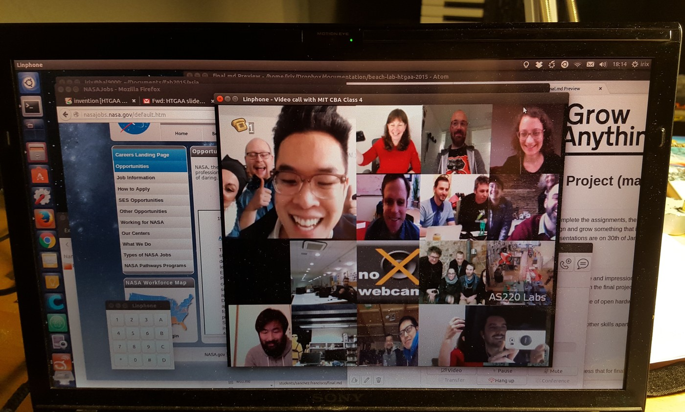

# Week 16. Invention and intellectual property

## Lecture video
Link to the [video lecture](https://vimeo.com/148382539)

Today it was the **last day** of HTGAA, with many interesting talks coming from very diverse people. We also had NASA astronaut [Catherine Coleman](https://en.wikipedia.org/wiki/Catherine_Coleman), I learnt a lot from her interesting talk. These are **some of the gems** I captured:

> **Sharing:** "The line to pay attention to is the green one, and that's India. In their very first try India got something into the orbit of Mars. And that's because we shared the deep space network with them. We shared our data, we shared our lessons learnt. Space exploration is going to happen in a very cooperative way, as it should."  
>
> **Communication:** "You can do the best inventions you want to, but if you can't communicate them in a way that is interesting and palatable to the people who establish the money in the US, you are not going to make it. So communication is a really big part of that."
>
> **Showcase yourself:** "Applying is a lesson in itself and a lesson not just for being an astronaut but for all the things you want to do because it forces you really to think, how do I show me on a piece of paper or a electronic form, that makes people realise they should want to meet me. "  
>  
> _Catherine Coleman_

So **this is it, this was HTGAA'15**. The first, crazy and messy Sinthetic Biology course which I had the pleasure to attend. **I would like to thank all the people who with their effort and cooperation made HTGAA a reality**. This is not the end. This the beginning.

## Assignment  
The assignment this week is to complete and document the final project. _Design and describe a project that uses at least 3 different techniques you have learned during HTGAA, and depending on your current setup, build/grow/develop the project as far as possible. Project presentations are on the 13th of January, 2016._ The final project has been documented in a separate [page](./final.html).

---

## [<<](./w15.html)  [  home  ](./index.html)  [  >>](./w17.html)
